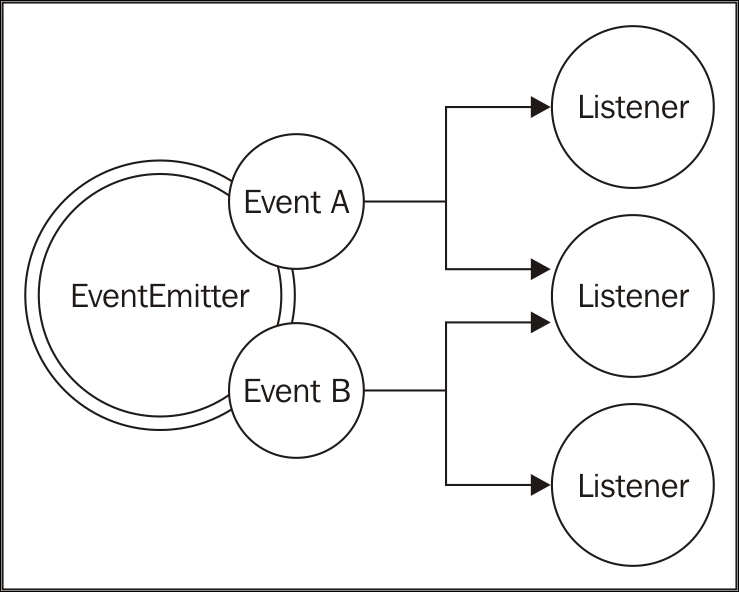

Node.js에서 사용되는 또 다른 중요하고 기본적인 패턴은 관찰자 패턴(Observer Pattern)이다.
Reactor, Callback, Module과 함께 Observer Pattern은 플랫폼의 핵심 중 하나이다.

관찰자 패턴은 Node.js의 반응적인 특성을 모델링하고 콜백을 완벽하게 보완하는 해결책이다.
정의는 다음과 같다.

> **_관찰자 패턴_**은 상태 변화가 일어날 때 관찰자(또는 Listener)에게 알릴 수 있는 객체
> (Subject라고 불린다)를 정의하는 것이다.

콜백 패턴과의 가장 큰 차이점은 Subject가 실제로 여러 관찰자(Observer)들에게 알릴 수 있다는 점이다.
전통적이 연속 전달 스타일 콜백은 일반적으로 그 결과를 하나의 Listener 인 콜백에만 전파한다.

---

### EventEmitter 클래스

전통적인 객체지향 프로그래밍에서 관찰자 패턴에는 인터페이스와 구현된 클래스들 그리고 계층 구조가 필요하다.
그러나 Node.js에서는 EventEmitter 클래스를 사용하면 된다.
EventEmitter 클래스를 사용하여 특정 유형의 이벤트가 발생되면 호출될 하나 이상의 함수를 Listener로 등록할 수 있다.


링크 : [https://subscription.packtpub.com/book/web_development/9781785885587/2/ch02lvl1sec14/the-observer-pattern](https://subscription.packtpub.com/book/web_development/9781785885587/2/ch02lvl1sec14/the-observer-pattern)

EventEmitter는 **프로토타입(prototype)이며** 코어 모듈로부터 익스포트 된다.
다음 코드는 우리가 EventEmitter에 대한 참졸를 얻을 수 있는 방법을 보여준다.

```javascript
const EventEmitter = require("events").EventEmitter;
const eeInstance = new EventEmitter();
```

EventEmitter의 필수 메소드는 다음과 같다.

-   on(event, listener) : 이 메소드를 사용하면 주어진 이벤트 유형(문자열)에 대해 새로운 listener를 등록할 수 있다.
-   once(event, listener) : 이 메소드는 첫 이벤트가 전달된 후 제거되는 새로운 listener를 등록한다.
-   emit(event, [arg1], [...]) : 이 메소드는 새 이벤트를 생성하고 listener에게 전달할 추가적인 인자들을 지원한다.
-   removeListener(event, listener) : 이 메소드는 지정된 이벤트 유형에 대한 listener를 제거한다.

앞의 모든 메소드들은 연결(chaining)을 가능하게 하기 위해 EventEmitter 인스턴스를 반환한다.
listener 함수는 시그니처 함수([arg1], [...])를 가지고 있기 떄문에 이벤트가 발생된 순간에 전달되는 인수들을 쉽게 받아 들일 수 있다. listener 내부에서는 이벤트를 생성하는 EventEmitter의 인스턴스를 참조한다.

앞서 이미 listener와 전통적인 Node.js 콜백 간에 큰 차이가 있음을 보았다.
특히, 첫 번째 인자가 꼭 에러(error)일 필요는 없으며, emit()이 호출될 때 전달된 어떤 값이든 가능하다.

---

### EventEmitter 생성 및 사용

실제로 EventEmitter를 어떻게 사용할 수 있는지 보도록 하겠다.
가장 간단한 방법은 새로운 인스턴스를 만들어 바로 사용하는 것이다.
다음 코드는 EventEmitter를 사용하여 파일 목록에서 특정 패턴이 발견되면 실시간으로 구독자들에게 알리는 함수를 보여준다.

```javascript
const EventEmitter = require("events").EventEmitter;
const fs = require("fs");

function findPattern(files, regex) {
    const emitter = new EventEmitter();
    files.forEach(file => {
        fs.readFile(file, "utf8", (err, content) => {
            if (err) return emitter.emit("error", err);
        });

        emitter.emit("fileread", file);
        let match;
        if ((match = content.match(regex)))
            match.forEach(elem => emitter.emit("found", file, elem));
    });
    return emitter;
}
```

위의 함수로 만든 EventEmitter는 세 가지 이벤트를 생성한다.

-   fileread: 이 이벤트는 파일을 읽을 때 발생한다.
-   found: 이 이벤트는 일치하는 항목이 발견되었을 때 발생한다.
-   error: 이 이벤트는 파일을 읽는 동안 오류가 발생했을 때 발생한다.

filePattern() 함수를 어떻게 사용할 수 있는지 알아보자.

```javascript
findPattern(["fileA.txt", "fileB.json"], "/hello w+g")
    .on("fileread", file => console.log(file + " was read"))
    .on("found", (file, match) =>
        console.log('Matched "' + match + '" in file ' + file)
    )
    .on("error", err => console.log("Error emitted: " + err.message));
```

앞의 예에서 findPattern() 함수에서 만들어진 EventEmitter에 의해 생성된 세 가지 유형의 이벤트 각각에 대해 listener를 등록했다.

---

#### 오류 전파

EventEmitter는 이벤트가 비동기적으로 발생할 경우, 이벤트 루프에서 손실될 수 있기 때문에 콜백에서와 같이 예외가 발생해도 예외를 바로 throw할 수 없습니다. 대신, 규약에 의해 error라는 특수한 이벤트를 발생시키고, Error 객체를 인자로 전달한다.
이것이 정확히 우리가 앞에서 정의한 findPattern() 함수에서 하고 있는 것이다.

Node.js는 특별한 방식으로 에러 이벤트를 처리하고 예외를 자동으로 throw하며, 이에 연결된 리스너가 없는 경우 프로그램을 종료하므로 항상 에러 이벤트에 대한 리스너를 등록하는 것이 좋다.

---

#### 관찰 가능한 객체 만들기

때로는 EventEmitter 클래스를 가지고 직접 새로운 관찰 대상 객체를 만드는 것만으로는 충분하지 않을 수 있다.
이런 방식으로 단순한 새로운 이벤트를 만드는 것 이상의 기능을 제공하는 것은 비현실적이다.
실제로 일반적인 객체를 관찰 가능하게 만드는 것이 일반적이다.
이것은 EventEmitter 클래스를 확장함으로써 가능하다.

이 패턴을 설명하기 위해 다음과 같이 객체에서 findPattern() 함수의 기능을 구현해 보겠다.

```javascript
const EventEmitter = require("events").EventEmitter;
const fs = require("fs");

class FindPattern extends EventEmitter {
    constructor(regex) {
        super();
        this.regex = regex;
        this.files = [];
    }

    addFile(file) {
        this.files.push(file);
        return this;
    }

    find() {
        this.files.forEach(file => {
            fs.readFile(file, "utf8", (err, content) => {
                if (err) {
                    return this.emit("error", err);
                }

                this.emit("fileread", file);

                let match = null;
                if ((match = content.match(this.regex))) {
                    match.forEach(elem => this.emit("found", file, elem));
                }
            });
        });
        return this;
    }
}
```

우리가 정의한 FindPattern 프로토타입은 코어 모듈 util에서 제공하는 inherits() 함수를 사용하여 EventEmitter를 확장한다.
이 같은 방법으로 완벽하게 관찰 가능한 클래스가 된다.
다음은 그 사용의 예다.

```javascript
const findPatternObject = new FindPattern(/hello \w+/);
findPatternObject
    .addFile('fileA.txt')
    .addFile('fileB.json')
    .find()
    .on('found', (file,match) => console.log(`Matched "${match}
    " in file ${file}`))
    .on('error', err => console.log(`Error emitted ${err.message}`)
```

FindPattern 객체가 전체 메소드를 그대로 보유한 상태에서 EventEmitter의 기능을 상속함으로써 어떻게 관찰 가능하게 되는지를 확인할 수 있다.

이것은 Node.js에서 꽤 일반적인 패턴이다. 예를 들어 핵심 HTTP 모듈인 Server 객체는
listen(), close(), setTimeout()과 같은 메소드를 정의하며 내부적으로 EventEmitter 함수에서 상속받는다.
따라서 새로운 요청이 수신될 때 request 이벤트, 새로운 연결이 설정되면 connection 이벤트 그리고 서버가 닫히면 closed 이벤트가 생성된다.

---

#### 동기 및 비동기 이벤트

이벤트는 콜백과 마찬가지로 동기식 또는 비동기식으로 생성될 수 있다.
동일한 EventEmitter에서 두 가지 접근 방식을 섞어서는 안된다.

동기 이벤트와 비동기 이벤트를 발생시키는 주된 차이점은 리스너를 등록할 수 있는 방법에 있다.
이벤트가 비동기적으로 발생하면 EventEmitter가 초기화된 후에도 프로그램은 새로운 리스너를 등록할 수 있다.
이벤트가 이벤트 루프의 다음 사이클이 될 때까지는 실행되지 않을 것이기 때문이다.
findPattern() 함수에서 일어나는 것이 바로 이것이다.
우리는 이 함수를 앞서 정의했었고, 이것은 대부분의 Node.js 모듈에서 사용되는 일반적인 접근법을 보여준다.

반대로 이벤트를 동기적으로 발생시키려면 EventEmitter함수가 이벤트를 방출하기 전에 모든 리스너가 등록 되어 있어야 한다.

```javascript
const EventEmitter = require("events").EventEmitter;

class SyncEmit extends EventEmitter {
    constructor() {
        super();
        this.emit("ready");
    }
}

const syncEmit = new SyncEmit();
syncEmit.on("ready", () => console.log("Object is ready to be used"));
```

ready 이벤트가 비동기적으로 발생된다면 앞의 코드는 완벽하게 동작한다.
그러나 이벤트가 동기적으로 생성되면 이벤트가 이미 전송된 후 리스너가 등록되므로 결과적으로 리스너가 호출되지 않는다.
코드는 아무것도 콘솔에 출력하지 않는다.

EventEmitter 함수를 다른 목적을 위해 동기적으로 사용하는 것이 타당한 경우도 있다.
이러한 이유 때문에, 혼란과 잠재적인 오용을 피하기 위해 문서를 통해 자신의 EventEmitter의 동작을 명확하게 인지시키는 것이 매우 중요하다.

---

#### EventEmitter vs Callback

비동기식 API를 정의할 때 공통적인 딜레마는 EventEmitter를 사용할지 아니면 단순하게 콜백을 사용할 지를 결정하는 것이다.
일반적인 판단 규칙은 그 의미에 있다.

결과가 비동기 방식으로 반환되어야 하는 경우는 **콜백**을 사용한다.
대신 **이벤트**는 무엇인가를 전달할 필요가 있을 때 사용한다.

그러나 이 간단한 원칙 외에도 두 가지 패러다임이 대부분 동등하고 동일한 결과를 얻을 수 있다는 사실 때문에 많은 혼란이 발생한다.

```javascript
function helloEvents() {
    const eventEmitter = new EventEmitter();
    setTimeout(() => eventEmitter.emit("hello", "hello world"), 100);
    return eventEmitter;
}

function helloCallback(callback) {
    setTimeout(() => callback("helloworld"), 100);
}
```

두 함수 helloEvnets()와 helloCallback()는 기능면에서 동일한 것으로 생각할 수 있다.
첫 번째 호출은 이벤트를 사용하여 타임아웃이 되었음을 알리고, 두 번째는 대신 호출자에게 콜백을 사용하여 통지하면서 내용을 인자로 전달한다.
그러나 실제로 이들을 구별하는 것은 가독성, 의미, 구현 또는 사용되는데 필요한 코드의 양이다.
어떤 스타일을 선택할 지에 대한 규칙을 제공할 수는 없지만 결정을 내리는데 도움이 될 수 있는 몇 가지 힌트는 제공할 수는 있다.

지금까지의 관찰을 통해 콜백에는 여러 가지 유형의 이벤트를 지원할 경우 몇 가지 제한이 있다는 것을 알 수 있다.
실제 우리는 여전히 콜백의 인자로 결과 유형을 전달하거나 각 이벤트마다 여러 콜백을 받을 수 있도록 하여 이벤트를 구분할 수 있다.
**그러나 이것이 정확하게 좋은 API라고 간주하기는 어렵다.**

이 상황에서 EventEmitter는 더 적은 코드로 더 나은 인터페이스를 제공할 수 있다.

EventEmitter가 더 좋은 또 다른 경우는 동일한 이벤트가 여러 번 발생할 수도 있고 전혀 발생하지 않을 수도 있는 경우다.
실제로 콜백은 작업의 성공 여부와 상관 없이 정확히 한번 호출되어야 한다.
우리가 반복적인 상황에 놓인다는 사실은 사건의 발생이라는 의미의 본질에 대해 다시 생각하게 된다.
이 경우 결과보다는 정보가 전달되어야 하는 이벤트에 더 가까우며 EventEmitter가 더 좋은 선택이 된다.

마지막으로 콜백을 사용하는 API는 특정 콜백에만 알릴 수 있지만 EventEmitter 함수를 이용하면 여러 수신자가 동일한 알림을 수신할 수 있다.

---

#### Callback과 EventEmitter의 결합

EventEmitter를 콜백과 함께 사용할 수 있는 경우도 있다.
이 패턴은 메인 함수로 전통적인 비동기 함수를 익스포트하여 최소한의 인터페이스라는 원칙을 지키면서도 EventEmitter를 반환하여 더 풍부한 기능과 제어를 제거오하고자 할 때 매우 유용하다.
이 패턴의 한 예는 glob 스타일 파일 검색 라이브러리인 node-glob 모듈이 보여주고 있다.
모듈의 주요 진입점은 아래와 같은 고유 특징을 가진 exports 함수이다.

```javascript
glob(pattern, [options], callback);
```

함수는 첫 번째 인자로 패턴을, 두 번쨰 인자로 일련의 옵션을 그리고 세 번째 인자로 주어진 패턴과 일치하는 모든 파일의 리스트를 가지고 호출될 콜백 함수를 취한다.
동시에 이 함수는 프로세스 상태에 대해 보다 세분화된 알림을 제공하는 EventEmitter를 반환한다.
예를 들어 end 이벤트가 일어날 때, 모든 일치된 파일 목록들을 얻기 위해 match 이벤트가 일어날 때마다 실시간으로 알림을 받거나 abort 이벤트 수신을 통해 수동으로 프로세스가 중단되었는지 여부를 알 수 있다.
다음 코드는 어떻게 사용하는지를 보여준다.

```javascript
const glob = require("glob");
glob("data/*.txt", (error, files) =>
    console.log(`ALL files found:
    ${JSON.stringify(files)}`)
).on("match", match => console.log(`Match found: ${match}`));
```

우리가 볼 수 있듯이, 단순하고 깨끗하게 최소한의 메인 함수를 노출하면서도 보조적인 함수들을 제공함으로써 중요하거나 덜 중요한 기능을 구분하여 제공하는 방식은 Node.js에서 매우 흔하다.
여기서는 EventEmitter를 통해 전통적인 방법과 결합하고 있다.
