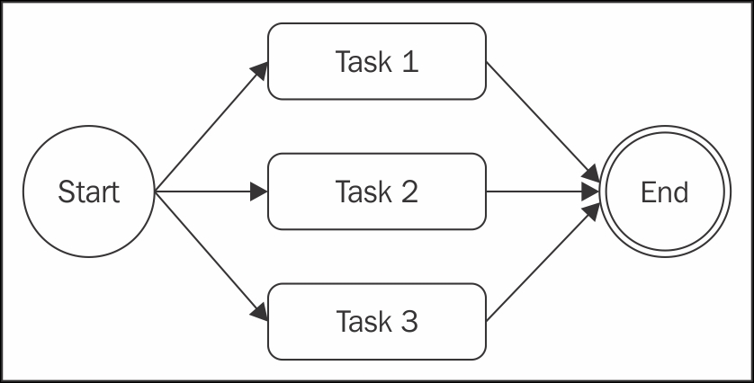

### 일반 JavaScript의 사용

#### 콜백 규칙

비동기 코드 작성 시 유의 사항 중 첫 번째는 **콜백을 정의할 때 함부로 클로저를 사용하지 않는 것이다.**
모듈화 및 재사용과 같은 문제에 대한 추가적인 사항을 고려할 필요가 없어지는 장점이 있지만 단점이 더 많은 방식일 수 있다.
콜백 헬 문제는 간단한 방법으로 해결 할 수 있다.

다음은 중첩 수준을 낮게 유지하고 일반적으로 코드 체계를 개선하는데 도움이 되는 몇 가지 기본 원칙이다.

-   가능한 빨리 종료한다. 문맥에 따라 return, continue 또는 break를 사용하면 if ... else 문(및 중첩) 을 모두 작성하는 대신 현재 문을 즉시 종료할 수 있다.
    이렇게 하면 코드를 얕게 유지하는데 도움이 된다.
-   콜백을 위해 명명된 함수를 생성하여 클로저 바깥에 배치하며 중간 결과를 인자로 전달한다.
    함수의 이름을 지정하면 스택 추적에서 더 잘 보이기 때문이다.
-   코드를 모듈화 한다. 가능하면 코드를 작고 재사용 가능한 함수로 분할한다.

#### 콜백 규칙 적용

앞에서 언급한 원칙의 힘을 보여주기 위해서 웹 스파이더 어플리케이션에서 콜백 헬 문제를 해결 하기 위해 적용해보자.

첫 번째 단계로 else 문을 제거하여 오류 검사 패턴을 재구성 할 수 있다.
이는 오류를 받는 즉시 함수로부터 복귀가 가능하다.
따라서 코드를 다음과 같이 개선해보자

```javascript
//개선 전 코드
if (err) {
    callback(err);
} else {
    // 오류가 없을 때 실행할 코드
}

//개선 후 코드
if (err) {
    return callback(err);
}
// 오류가 없을 떄 실행 할 코드
```

이 간단한 트릭은 함수의 중첩 수준을 줄여준다. 또한 적용할 때 복잡한 리팩토링이 필요하지도 않다.

> **여기서 방금 설명한 최적화를 실행하는 일반적인 실수 중 하나가 콜백이 호출된 후에 함수를 종료하는 것을 잊는 것이다.**
> 오류 처리 시나리오의 경우 다음 코드가 일반적인 문제의 원인이다.
>
> ```javascript
> if (err) {
>     callback(err);
> } // 오류가 없을 때 실행할 코드
> ```
>
> 콜백을 호출한 후에도 함수의 실행이 계속된다는 것을 잊으면 안된다.
> **그러므로 나머지 함수의 실행을 차단하는 return 명령을 삽입하는 것이 중요하다.**
> 실제로 _함수가 반환하는 결과는 중요하지 않다._
> 실제 결과(또는 오류)는 비동기적으로 생성되어 콜백에 전달된다.
> 비동기 함수의 반환값은 대개 무시된다. 이 속성을 사용하면 다음과 같이 단순하게 작성할 수 있다.
>
> ```javascript
> return callback(...)
> ```
>
> 이 코드는 다음과 같다.
>
> ```javascript
> callback(...)
> return;
> ```

spider() 함수의 두 번째 최적화로 재사용 가능한 코드를 구분할 수 있다.
예를 들어, 파일에 주어진 문자열을 쓰는 기능은 다음과 같이 별도의 함수로 쉽게 분리할 수 있다.

```javascript
function saveFile(filename, contents, callback) {
    mkdirp(path.dirname(filename), err => {
        if (err) {
            return callback(err);
        }
        fs.writeFile(filename, contents, callback);
    });
}
```

동일한 원칙에 따라 URL과 파일 이름을 입력으로 사용하여 URL로 주어진 파일을 다운로드하는 download()라는 일반 함수를 만들 수 있다.
내부적으로 앞서 만든 saveFile() 함수를 사용할 수 있다.

```javascript
function download(url, filename, callback) {
    console.log(`Downloading ${url}`);
    request(url, (err, response, body) => {
        if (err) {
            return callback(err);
        }
        saveFile(filename, body, err => {
            if (err) {
                return callback(err);
            }
            console.log(`Downloaded and saved: ${url}`);
            callback(null, body);
        });
    });
}
```

마지막 단계로 spider() 함수를 수정한다.
변경 사항을 적용하면 spider() 함수는 이제 다음과 같은 형태가 된다.

```javascript
function spider(url, callback) {
    const filename = utilities.urlToFilename(url);
    fs.exists(filename, exists => {
        if (exists) {
            return callback(null, filename, false);
        }
        download(url, filename, err => {
            if (err) {
                return callback(err);
            }
            callback(null, filename, true);
        });
    });
}
```

spider() 함수의 기능 및 인터페이스는 완전히 똑같다.
코드가 구성된 방식만 바뀌었다.
코드의 중첩을 줄일 수 있었고, 동시에 재사용성 및 테스트 가능성을 높일 수 있었다.
saveFile()과 download()를 모두 익스포트하여 다른 모듈에서 재사용하도록 할 수 있다.
이로 인해 이들의 기능을 보다 쉽게 테스트 할 수 있다.

---

#### 순차 실행

이제 비동기 제어 흐름 패턴에 대한 탐구를 시작해보자.
일련의 작업을 순차적으로 실행한다는 것은 한 번에 하나씩 실행한다는 것을 의미한다.
목록상의 작업 결과가 다음 작업의 실행에 영향을 줄 수 있으므로 실행 순서가 중요하다.
따라서 이를 보존해야 한다.


[출처: https://subscription.packtpub.com/book/web_development/9781785885587/3/ch03lvl1sec17/using-plain-javascript](https://subscription.packtpub.com/book/web_development/9781785885587/3/ch03lvl1sec17/using-plain-javascript)

이 흐름에는 다양한 변형이 있다.

-   결과를 전달하거나 전파하지 않고 일련의 알려진 작업을 순서대로 실행한다.
-   작업의 출력을 다음 작업의 입력으로 사용한다.(Chain, Pipeline 또는 Waterfall이라고 한다.)
-   순차적으로 각 요소에 대해 비동기 작업을 실행하면서 일련의 작업들을 반복한다.

순차 실행은 직접 방식의 블로킹 API를 사용하여 구현할 때는 간단하지만, 일반적으로 비동기 CPS를 사용하여 구현할 경우 콜백 헬(Callback Hell)의 주요 원인이 된다.

##### 알려진 일련의 작업에 대한 순차 실행

이전 섹션에서 spider() 함수를 구현하면서 순차 실행을 이미 보았다.
우리가 살펴본 간단한 규칙들을 적용하여 순차적 실행 흐름에서 일련의 알려진 작업을 구성할 수 있었다.
이 코드를 지침 삼아 다음 패턴으로 솔루션을 일반화 할 수 있다.

```javascript
function task1(callback) {
    asyncOperation(() => {
        task2(callback);
    });
}

function task2(callback) {
    asyncOperation(() => {
        task3(callback);
    });
}

function task3(callback) {
    asyncOperation(() => {
        callback(); // 최종적으로 실행되는 콜백
    });
}
task1(() => {
    //태스크1, 태스크2 및 태스크3가 완료될 때 실행됨
    console.log("tasks 1, 2 and 3 excuted");
});
```

앞의 패턴은 일반적인 비동기 작업 완료 시, 각 작업이 다음 작업을 호출하는 방법을 보여준다.
이 패턴은 작업의 모듈화에 중점을 두어 비동기 코드를 처리하는데 항상 클로저를 사용할 필요가 없다는 것을 보여준다.

##### 순차 반복

앞에서 설명한 패턴은 실행될 작업의 수와 양을 미리 **알고 있을 경우** 완벽하게 작동한다.
이렇게 하면 시퀀스의 다음 작업 호출을 하드코딩할 수 있다.
그러나 컬렉션의 각 항목에 대해 비동기 작업을 실행하려면 어떨까?
이와 같은 경우에는 동적으로 구축해야 한다.

###### 웹 스파이더 버전 2

순차 반복의 예를 보여주기 위해 웹 스파이더 어플리케이션에 새로운 형태를 소개한다.
이제 웹 페이지에 포함된 모든 링크를 재귀적으로 다운로드 한다.
그렇게 하기 위해 우리는 페이지에서 모든 링크를 추출한 다음, 각각의 웹 스파이더를 재귀적으로 순서대로 시작한다.

첫 번째 단계는 spider() 함수를 수정한 spiderLinks()라는 함수를 사용하여 페이지의 모든 링크를 재귀적으로 다운로드 하도록 하는 것이다.

또한 파일이 이미 존재하는지 체크하는 대신, 이제 해당 파일에 대한 읽기를 먼저 시도하여 파일 내의 링크들의 수집을 시작한다.
이런 방식으로 중단된 다운로드들을 다시 시작할 수 있다.
마지막 변경으로 재귀의 깊이를 제한하는데 사용되는 nesting이라는 새로운 인자를 전달한다.

```javascript
function spider(url, nesting, callback) {
    const filename = utilities.urlToFilename(url);
    fs.readFile(filename, "utf8", (err, body) => {
        if (err) {
            if (err.code !== "ENOENT") {
                return callback(err);
            }

            return download(url, filename, (err, body) => {
                if (err) {
                    return callback(err);
                }
                spiderLinks(url, body, nesting, callback);
            });
        }
        spiderLinks(url, body, nesting, callback);
    });
}
```

##### 링크들의 순차 크롤링

이제 웹 스파이더 어플리케이션의 새로운 버전인 spiderLinks() 함수의 핵심을 만들어야 한다.
spiderLinks() 함수는 순차 비동기 반복 알고리즘을 사용하여 HTML 페이지의 모든 링크를 다운로드 한다.
다음 코드 블록에서 이를 정의하는 방식을 잘 살펴볼 필요가 있다.

```javascript
function spiderLinks(currentUrl, body, nesting, callback) {
    if (nesting === 0) {
        return process.nextTick(callback);
    }
    const links = utilities.getPageLinks(currentUrl, body); // [1]
    function iterate(index) {
        //[2]
        if (index === links.length) {
            return callback();
        }
        spider(links[index], nesting - 1, err => {
            //[3]
            if (err) {
                return callback(err);
            }
            iterate(index + 1);
        });
    }
    iterate(0); //[4]
}
```

새로운 함수에서 이해해야 할 중요한 단계들은 다음과 같다.

1. utilities.getPageLinks() 함수를 통해 페이지에 포함된 모든 링크 목록을 가져온다. 이 함수는 내부의 대상(동일한 호스트 이름)을 가리키는 링크들만 반환한다.
2. iterate()라는 로컬 함수를 사용하여 링크를 반복한다. iterate()는 분석할 다음 링크의 인덱스를 사용한다. 이 함수에서 먼저 하는 일은 인덱스가 링크 배열의 길이와 같은지 확인 하는 것이다. 이 경우 모든 항목을 처리했으므로 즉시 callback() 함수를 호출한다.
3. 이 시점에서 링크를 처리하기 위한 모든 준비가 완료되어야 한다. 중첩 레벨을 줄여 spider() 함수를 호출하고 작업이 완료되면 반복의 다음 단계를 호출한다.
4. spiderLinks() 함수의 마지막 단계에서 iterate(0)를 호출하여 재귀 작업을 시작시킨다.

우리가 방금 작성한 알고리즘은 순차적으로 비동기 연산을 실행하여 배열을 반복할 수 있게 해준다. 이 경우에서는 spider() 함수이다.

이제 이 새로운 버전의 스파이더 어플리케이션을 시험해 보면 웹 페이지의 모든 링크를 하나씩 순차적으로 다운로드 하는 것을 볼 수 있다.

##### 패턴

앞서 살펴본 spiderLinks() 함수의 코드는 비동기 작업을 사용하면서 컬렉션을 반복하는 방법에 대한 명확한 예이다.
또한 컬렉션의 요소들이나 또는 일반적인 작업 목록에 대해 비동기 순차적으로 반복해야 하는 상황에 사용할 수 있는 패턴이라는 것을 알 수 있다.
이 패턴은 다음과 같이 일반화 할 수 있다.

```javascript
function iterate(index) {
    if (index === tasks.length) {
        return finish();
    }
    const task = tasks[index];
    task(() => iterate(index + 1));
}

function finish() {
    // 반복 작업이 완료된 후 처리
}
iterate(0);
```

> task()가 동기 연산일 경우에 알고리즘이 완전히 재귀적이 되어, 최대 콜 스택의 크기 제한을 초과할 위험이 있다.

방금 살펴본 패턴은 여러 가지 상황에 적용 할 수 있기 때문에 매우 강력하다.
예를 들어, 배열의 값들을 맵핑하거나 반복문에서 연산의 결과를 다음 반복에 전달하여 reduce 알고리즘을 구현할 수 있다.
특정 조건이 충족되면 루프를 조기에 중단하거나 무한히 반복할 수도 있다.

또한 다음 처럼 함수로 감싸서 솔루션을 일반화 시킬 수도 있다.

```javascript
iterateSeries(collection, iteratorCallback, finalCallback);
```

> **_iterator 패턴_**
> iterator라는 함수를 작성하여 작업의 목록을 차례대로 실행하라.
> iterator 컬렉션에서 다음에 사용 가능한 태스크를 호출하고 현재 태스크가 완료될 때 반복의 다음 단계를 호출하도록 한다.

---

#### 병렬 실행

일련의 비동기 작업들의 실행 순서가 중요하지 않고 단지 이런 작업들의 모든 실행이 끝났을 때 알림을 받으면 되는 경우가 있다. 이렇나 상황은 다음 그림과 같은 병렬 실행 흐름을 사용하여 보다 효과적으로 처리할 수 있다.


[출처 : https://subscription.packtpub.com/book/web_development/9781785885587/3/ch03lvl1sec17/using-plain-javascript](https://subscription.packtpub.com/book/web_development/9781785885587/3/ch03lvl1sec17/using-plain-javascript)

실제로 Node.js의 경우 작업을 동시에 실행하는 것이 아니라 논 블로킹 API 위에서 실행되고 이벤트 루프에 의해 인터리브 된다는 것을 의미한다.

작업이 새로운 비동기 작업을 요청할 때, 이벤트 루프가 새로운 작업을 실행할 수 있도록 제어를 이벤트 루프로 돌려 준다.
이러한 종류의 흐름에 적절한 용어는 동시성이지만, 일단 병렬이라는 용어를 사용하겠다.

아래 그림은 Node.js 프로그램에서 두 개의 비동기 작업을 병렬로 실행하는 방식을 보여 준다.


[출처 : https://subscription.packtpub.com/book/web_development/9781785885587/3/ch03lvl1sec17/using-plain-javascript](https://subscription.packtpub.com/book/web_development/9781785885587/3/ch03lvl1sec17/using-plain-javascript)

그림에서 두 개의 비동기 작업을 실행하는 Main 함수가 있다.

1. Main 함수는 Task1과 Task2를 실행시킨다. 이와 같이 비동기 작업이 시작되면 즉시 컨트롤을 Main 함수로 되돌려 주며, Main 함수는 이를 이벤트 루프로 반환한다.
2. Task1의 비동기 작업이 완료되면 이벤트 루프가 제어를 돌려준다. Task1이 작업을 완료하면 Main 함수에 이를 통지한다. 이때 Task1의 자체적인 내부 작업 수행은 동기적이다.
3. Task2에 의해 시작된 비동기 작업이 완료되면 이벤트 루프가 해당 콜백을 호출하여 다시 제어를 Task2로 되돌려 준다. Task2가 끝나면 Main 함수에 다시 통지한다. 이 시점에서 Main 함수는 Task1과 Task2가 모두 완료되었음을 인지하고 있으므로 자신의 실행을 계속하거나 작업 결과를 다른 콜백으로 반환할 수 있다.

간단히 말해 Node.js에서는 논블로킹 API에 의해 내부적으로 동시 처리되기 때문에 병렬 비동기 작업으로 실행된다는 것이다.
Node.js에서 동기(블로킹) 작업은 실행을 비동기 작업으로 끼워 넣거나, setTimeout() 또는 setImmediate()로 지연시키지 않는 한 동시에 실행할 수 없다.

---

#### 웹 스파이더 버전 3

웹 스파이더 어플리케이션은 병렬 실행의 개념을 적용할 수 있는 좋은 재료다.
현재 이 어플리케이션은 링크된 페이지를 순차적으로 재귀를 사용하여 다운로드 하고 있다.
모든 링크된 페이지들을 병렬로 다운로드 하게 하여 프로세스의 성능을 쉽게 향상시킬 수 있다.

이를 위해서는 한번에 모든 spider() 작업을 생성하여 이들의 모든 작업이 완료될 때 최종 콜백을 호출하도록 spiderLinks() 함수를 수정해야 한다.

```javascript
function spiderLinks(currentUrl, body, nesting, callback) {
    if (nesting === 0) {
        return process.nextTick(callback);
    }
    const links = utilities.getPageLinks(currentUrl, body);
    if (links.length === 0) {
        return process.nextTick(callback);
    }

    let completed = 0,
        hasErrors = false;

    function done(err) {
        if (err) {
            hasErrors = true;
            return callback(err);
        }
        if (++completed === links.length && !hasErrors) {
            return callback();
        }
    }

    links.forEach(link => {
        spider(link, nesting - 1, done);
    });
}
```

이전과의 차이점은 이제 spider() 작업은 모든 작업을 한번에 시작한다.
이것은 앞선 작업이 완료되기를 기다리지 않고, 단순히 배열 내의 링크에 대해 각각의 작업을 시작시키는 것으로 충분하다.

```javascript
links.forEach(link => {
    spider(link, nesting - 1, done);
});
```

그런 다음 어플리케이션이 모든 작업을 완료할 때까지 기다리는 방법은 spider() 함수에 done() 이라는 특수한 콜백을 제공하는 것이다.
done() 함수는 spider() 작업이 완료되면 카운터를 증가 시킨다.
완료된 다운로드 수가 링크 배열의 크기에 도달하면 최종 콜백이 호출된다.

```javascript
function done(err) {
    if (err) {
        hasErrors = true;
        return callback(err);
    }
    if (++completed === links.length && !hasErrors) {
        callback();
    }
}
```

이렇게 변경한 후 웹 페이지에 대해 spider()를 실행하려고 하면, 이전 링크가 처리될 때까지 기다리지 않고 모든 다운로드가 병렬로 진행되므로 전체 프로세스의 속도가 크게 향상된다.

##### 패턴

또한, 병렬 실행 흐름을 위한 작지만 멋진 패턴을 뽑아 낼 수 있으며, 상황에 따라 재사용할 수 있다.
다음 코드를 사용하여 일반적인 버전의 패턴을 표현할 수 있다.

```javascript
const tasks = [
    /* ... */
];
let completed = 0;
tasks.forEach(task => {
    task(() => {
        if (++completed === tasks.length) {
            finish();
        }
    });
});

function finish() {
    // 모든 작업이 완료됨
}
```

패턴을 적용하여 적은 수정으로 각 작업의 결과를 컬렉션에 모으거나, 배열의 요소를 필터링하거나 또는 맵핑하거나, 일정한 작업의 수가 완료되면 즉시 finish() 콜백을 호출하도록 할 수 있다.
특히 이 마지막 상황을 경쟁(race) 라고 부른다.

> 무제한 병렬 실행 패턴
> 한 번에 모든 항목을 생성하여 일련의 비동기 작업들을 병렬로 실행한 다음, 콜백이 호출된 횟수를 계산하여 모든 작업이 완료되기를 기다린다.

##### 동시 작업에서의 경쟁 조건 조정

Node.js에서는 여러 개의 비동기 작업을 병렬로 실행 하는 것이 리소스 측면에서 직관적이면서 비용이 적게 든다.
이것은 Node.js의 가장 중요한 강점 중 하나이다.
병렬화를 일반적인 방식으로 사용하기 때문이다.

Node.js의 동시성 모델의 또 다른 중요한 특징은 작업 동기화 및 경쟁 조건을 다루는 방식이다.
다중 스레드 프로그램이에서 이것은 보통 잠금, 뮤텍스, 세마포어 및 모니터와 같은 구조를 사용하여 수행되며, 병렬화의 성능에 상당한 영향을 미칠 뿐만 아니라 가장 복잡한 측면 중 하나일 수 있다.
Node.js에서는 작업 동기화를 구현하는 방법이 단순하지만, 경쟁 조건이 없다는 얘기는 아니다.
문제의 근본적인 원인은 비동기 작업 호출과 그 결과 통지 사이에 생기는 지연이다.
다음 코드를 보자.

```javascript
function spider(url, nesting, callback) {
    const filename = utilities.urlToFilename(url);
    fs.readFile(filename, "utf8", (err, body) => {
        if (err) {
            if (err.code !== "ENOENT") {
                return callback(err);
            }
        }
        return download(url, filename, function(err, body) {
            //...
        });
    });
}
```

여기서 문제는 동일한 URL에 대한 두 개의 spider 작업을 수행할 경우, 다운로드를 완료한 후 파일을 생성하지 않은 상황에서 fs.readFile()을 호출하게 되면 두 작업 모두 다운로드를 하게 된다는 것이다.
이 상황은 다음과 같은 그림으로 표현할 수 있다.

[출처 : https://subscription.packtpub.com/book/web_development/9781785885587/3/ch03lvl1sec17/using-plain-javascript](https://subscription.packtpub.com/book/web_development/9781785885587/3/ch03lvl1sec17/using-plain-javascript)

위 그림은 Task 1과 Task 2가 Node.js의 단일 스레드에서 인터리브되는 방법과 비동기 작업이 실제 경쟁 조건이 발생할 수 있는 경우를 보여준다.
우리의 경우 두 spider() 작업은 모두 같은 파일을 다운로드하게 된다.

이 문제의 해결법은 동일한 URL에서 실행되는 여러 spider() 작업을 상호 배제할 수 있는 변수가 있으면 가능하다.
다음 코드를 사용하면 이 작업을 수행할 수 있다.

```javascript
const spidering = new Map();
function spider(url, nesting, callback) {
    if (spidering.has(url)) {
        return process.nextTick(callback);
    }
    spidering.set(url, true);
}
```

지정된 URL에 한 표시가 spidering 맵에 존재하는 경우 함수는 즉시 종료된다.
그렇지 않을 경우 플래그를 설정하고 다운로드를 계속한다.
이 경우 두 개의 spider 작업이 완전히 다른 시점에 실행되더라도 다시 다운로드 하지 않을 것이라는 전제를 가지게 되기 때문에 잠금을 해지할 필요가 없다.

경쟁 상황은 단일 스레드 환경에 있어서도 많은 문제를 일으킬 수 있다.
경우에 따라서는 데이터 손상으로 이어질 수 있으며 일시적인 특성으로 인해 디버그 하기가 매우 여렵다.
따라서 작업을 병렬로 실행할 때 이러한 유형의 상황을 명확하게 확인하는 것이 좋다.

---

#### 제한된 병렬 실행

종종 제어하지 않고 병렬 작업을 생성하면 과도한 부하가 발생할 수 있다.
수천 개의 파일을 읽거나 URL에 접근하거나 데이터베이스에 대한 쿼리를 병렬로 실행한다고 가정해보자.
이러한 상황에서 흔히 발생하는 문제는 리소스가 부족하게 된다.
웹 어플리케이션에서는 DoS(Denial of Service) 공격으로 악용될 수 있는 취약점이 발생할 수도 있다.
이러한 모든 상황에서는 동시에 실행할 수 있는 작업의 수를 제한하는 것이 좋다.
그렇게 하면 서버의 부하에 대한 예측성을 가질 수 있고, 어플리케이션의 리소스가 부족하지 않도록 할 수 있다.
다음 그림은 동시 실행을 2로 제한한 상태에서 실행할 5개의 작업이 있는 상황을 설명한다.


[참조 : https://subscription.packtpub.com/book/web_development/9781785885587/3/ch03lvl1sec17/using-plain-javascript](https://subscription.packtpub.com/book/web_development/9781785885587/3/ch03lvl1sec17/using-plain-javascript)

그림에서 알고리즘이 어떻게 작동하는지 분명히 하자.

1. 처음에는 동시실행의 제한을 초과하지 않는 최대한 많은 작업을 생성한다.
2. 그런 다음 작업이 완료될 때마다 한도에 도달하지 않도록 하나 또는 하나 이상의 작업을 만든다.

##### 동시실행 제한하기

이제 제한된 동시성(concurrency)과 함께 주어진 일련의 작업들을 병렬로 실행하기 위한 패턴을 살펴보자

```javascript
const tasks= ...;
let concurrency = 2, running = 0, completed = 0, index = 0;
function next() { //[1]
    while(running < concurrency && index < tasks.length) {
        task = tasks[index++];
        task(() => { //[2]
            if(completed === tasks.length) {
                return finish();
            }
            completed++, running--;
            next();
        })
        running++;
    }
}
next();

function finish() {
    // 모든 작업이 완료됨
}
```

이 알고리즘은 순차 실행과 병렬 실행의 혼합으로 생각될 수 있다.
실제 이전에 이 장에서 제시한 두 가지 패턴과 유사하다는 것을 알 수 있다.

1. next()라는 반복 호출 함수가 있으며, 동시실행 제산 내에서 가능한 한 많은 작업을 병렬로 생성하는 내부 루프가 있다.
2. 다음 중요한 부분은 콜백이다. 이 콜백은 목록의 모든 작업을 완료했는지 확인한다. 실행할 작업(Task)이 있으면 next()를 호출하여 다른 작업(Task)을 생성한다.

##### 전역적으로 동시실행 제한하기

웹 스파이더 어플리케이션이 일련의 작업들에 대해 동시실행 제한을 적용해보는데 적합한 예가 될 듯 하다.
실제로 수천 개의 링크가 동시에 크롤링되는 상황을 피하기 위해 동시 다운로드 수가 예측 가능하도록 기능을 추가하여 이 프로세스의 동시실행 제한을 적용할 수 있다.

방금 배운 패턴을 spiderLinks() 함수에 적용할 수 있지만, 그렇게 되면 한 페이지 내에서 발견되는 링크들의 집합에 대한 동시실행 개수를 제한하는 것일 뿐이다. 예를 들어 동시실행의 숫자가 2라면 모든 페이지에 대해 최대 두 개의 링크를 병렬로 다운로드 할 수 있게 된다.
그러나 한 번에 여러 개의 링크를 다운로드 할 수 있게 되면 각 페이지에서 또 다른 두 개의 다운로드가 생성되어 다운로드 작업의 총계가 기하급수적으로 늘어난다.

###### 큐를 사용한 해결

우리가 정말 원하는 것은 우리가 동시에 실행할 수 있는 다운로드 작업의 전체 수를 제한하는 것이다.
이전의 사용했던 패턴을 약간 수정할 수 있겠지만, 이번 기회에 여러 작업의 동시실행을 제한하기 위해 큐(Queue)를 사용하는 또 다른 메커니즘을 소개하고자 한다.

이제 TaskQueue라는 간단한 클래스를 구현할 것이다.
TaskQueue는 앞서 살펴보았던 알고리즘과 큐를 결합한 것이다.
taskQueue.js라는 이름으로 새로운 모듈을 만들어 보자.

```javascript
class TaskQueue {
    constructor(concurrency) {
        this.concurrency = concurrency;
        this.running = 0;
        this.queue = [];
    }

    pushTask(task) {
        this.queue.push(task);
        this.next();
    }
    next() {
        while (this.running < this.concurrency && this.queue.length) {
            const task = this.queue.shift();
            task(() => {
                this.running--;
                this.next();
            });
            this.running++;
        }
    }
}
```

이 클래스의 생성자는 동시실행 제한만을 입력으로 받아 그 외에 running, queue와 같은 변수들을 초기화한다.
running 변수는 실행 중인 모든 작업을 추적하는데 사용되는 카운터이며, queue는 보류 중인 작업들을 저장하는 큐로 사용될 배열이다.

pushTask() 메소드는 단순히 새 작업을 큐에 추가한 다음, this.next()를 호출하여 작업 실행을 로드한다.

next() 메소드는 동시실행 제한을 초과하지 않도록 큐에서 일련의 작업을 만들어 낸다.

이 메소드는 이전에 제시한 동시실행을 제한하는 패턴과 몇 가지 유사점이 있음을 알 수 있다.
기본적으로 동시실행 제한을 초과하지 않는 가능한 최대한의 작업을 큐로부터 시작한다.
각 작업이 완료되면 실행 중인 작업 수를 갱신한 후에 next()를 다시 호출하여 다른 작업을 시작한다.
TaskQueue 클래스에서 흥미로운 점은 새 작업을 큐에 동적으로 추가할 수 있다.
다른 장점으로는 이제 작업들의 동시 실행 제한에 대한 엔티티를 중앙에서 가지고 함수 실행의 모든 인스턴스에 공유할 수 있다는 것이다.

---

##### 웹 스파이더 버전 4

이제 작업을 제한하여 병렬로 실행하기 위한 방안으로 일반적인 큐를 사용할 수 있으므로 웹 스파이더 어플리케이션에서 바로 사용해보자.
먼저 새로운 종속성을 추가하고 동시 실행 제한을 2로 설정한 TaskQueue 클래스의 새 인스턴스를 생성한다.

```javascript
const TaskQueue = require("./taskQueue");
const downloadQueue = new TaskQueue(2);
```

다음으로 새로 생성된 downloadQueue를 사용할 수 있도록 spiderLinks() 함수를 업데이트 해야 한다.

```javascript
function spiderLinks(currentUrl, body, nesting, callback) {
    if (nesting === 0) {
        return process.nextTick(callback);
    }

    const links = utilities.getPageLinks(currentUrl, body);
    if (links.length === 0) {
        return process.nextTick(callback);
    }

    let completed = 0,
        hasErrors = false;
    links.forEach(link => {
        downloadQueue.pushTask(done => {
            spider(link, nesting - 1, err => {
                if (err) {
                    hasErrors = true;
                    return callback(err);
                }
                if (++completed === links.length && !hasErrors) {
                    callback();
                }
                done();
            });
        });
    });
}
```

이 새로운 함수의 구현은 매우 쉽고 이 장의 앞 부분에서 설명한 무제한 병렬 실행 알고리즘과 매우 유사하다.
이는 동시실행 제어를 TaskQueue 객체에 위임하기 때문에 우리는 모든 작업이 완료되었는지만 확인하면 된다.
위 코드에서 흥미로운 부분은 작업이 어떻게 정의되었는가에 대한 것이다.

-   사용자 정의 콜백을 제공하여 spider() 함수를 실행한다.
-   콜백에서 spiderLinks() 함수 실행과 관련된 모든 완료되었는지 확인한다. 이 조건이 true면 spiderLinks() 함수의 최종 콜백을 호출한다.
-   작업이 끝나면 queue가 실행을 계속 할 수 있도록 done() 콜백을 호출한다.

이 간단한 변경을 적용한 후 스파이더 모듈을 다시 실행해 본다.
이번에는 동시에 두 개 이상의 다운로드가 활성화되지 않을 것이다.
