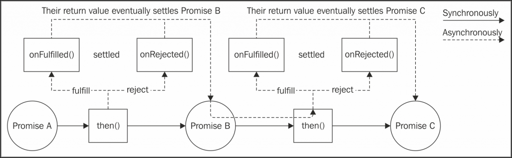

콜백은 JavaScript와 Node.js에서 비동기 프로그래밍을 위한 구성 요소지만 수년 동안 다른 대안들이 등장했다.
이러한 대안들은 비동기 코드를 보다 편하게 처리할 수 있는 방식으로 좀더 세련된 것들이다.

여기서는 그 대표적인 방법 중 하나인 Promise(프로미스)와 Generator(제너레이터)에 대해 알아보자.
또 ECMAScript 2017 릴리스의 일부로 JavaScript에서 사용할 수 있는 혁신적인 문법으로 async await도 살펴보겠다.

이러한 대안들을 통해 비동기식 프로그램의 제어 흐름을 처리하는 방법을 단순화 할 수 있는 방법을 알아보자.
마지막으로 각 접근법의 장단점을 모두 파악하고 이후 Node.js 프로젝트의 요구 사항에 가장 적합한 방식을 지혜롭게 선택할 수 있도록 이 모든 접근법을 비교해 볼 것이다.

---

### Promise(프로미스)

CPS(연속 전달 방식)가 비동기 코드를 작성하는 유일한 방법은 아니다.
콜백에 대한 가장 유명한 대안 중 하나가 프로미스(Promise)이다.
프로미스는 ECMAScript 2015의 일부이다.

#### 프로미스란 무엇인가?

**프로미스는 함수가 Promise라는 객체를 반환할 수 있도록 하는 추상화이다.**
Promise는 비동기 작업의 최종 결과를 나타낸다.
프로미스의 용어로 **대기중(pending)** 이란 아직 비동기 작업이 완료되지 않았다는 것이고, 성공적으로 끝났을 때를 **이행됨(fulfilled)**, 작업이 실패하여 종료되는 것을 **거부되었다(rejected)** 고 한다.
프로미스가 이행되거나 거부되면 **처리된(settled)** 것으로 간주된다.

이행(fulfillmenet) 값이나 거부(rejection)와 관련된 오류(원인)를 받으려면 Promise의 then() 메소드를 사용한다.

```javascript
promise.then([onFulfilled], [onRejected]);
```

위 코드에서 onFulfilled()는 최종적으로 프로미스의 이행 값(fulfillment value)을 받는 함수이고, 또 다른 함수인 onRejected()는 거부 이유(rejection reason)를 받게 됩니다.
두 함수 모두 선택 사항이다.

```javascript
asyncOperation(arg, (err, result) => {
    if (err) {
        // 에러 처리
    }
    // 결과 처리
});
```

프로미스를 통해 전형적인 CPS 코드를 보다 체계적인 구조로 변경하여 아래와 같이 좀 더 명쾌하게 할 수 있다.

```javascript
asyncOperation(arg).then(
    result => {
        // 결과 처리
    },
    err => {
        // 에러 처리
    }
);
```

then() 메소드의 중요한 특성 중 하나는 **동기식으로 다른 프로미스를 반환한다는 것이다.**
onFulfilled() 혹은 onRejected() 함수 중 하나가 x라는 값을 반환할 경우, then() 메소드가 반환하는 프로미스는 다음과 같다.

-   x가 값이면 이행(fulfill) 값 x를 가지고 핸들러가 호출된다.
-   x가 프로미스거나 thenable(then() 메소드가 존재)인 경우, x를 가지고 이행된 값(fulfillment value)을 가지고 핸들러가 호출된다.
-   x가 프로미스거나 thenable(then() 메소드가 존재)인 경우, x의 거부 이유(rejection reason)로 에러 핸들러가 호출된다.

> thenable은 then() 메소드를 가진 프로미스 같은 객체이다.
> 이 용어는 사용 중인 특정 프로미스와 다른 외부의 프로미스를 가리킬 때 사용한다.

이 기능을 사용하면 여러 가지 환경에서 비동기 작업을 손쉽게 통합하고 배치할 수 있는 프로미스 체인을 구성할 수 있다.
또한 onFulfilled() 또는 onRejected() 핸들러를 지정하지 않으면 이행 값 또는 거부 이유가 자동으로 체인 내의 프로미스들로 전달된다.
예를 들어, onRejected() 핸들러로 인해 catch될 때가지 전체 체인에 오류를 자동으로 전파할 수 있다.
프로미스 체인을 사용하게 되면 작업들을 순차 실행시키는 일은 그리 어렵지 않다.

```javascript
asyncOperation(arg)
    .then(result1 => {
        // 다른 프로미스를 반환
        return asyncOperation(arg2);
    })
    .then(result2 => {
        // 값을 반환
        return "done";
    })
    .then(undefined, err => {
        // 체인의 모든 에러를 여기서 처리함
    });
```

아래 그림은 프로미스 체인이 동작하는 방식을 설명한 것이다.


[참조 : https://subscription.packtpub.com/book/web_development/9781785885587/4/ch04lvl1sec20/promise](https://subscription.packtpub.com/book/web_development/9781785885587/4/ch04lvl1sec20/promise)

프로미스의 또 다른 중요한 특성은 앞의 예에서 체인의 마지막 then() 함수에서 "done"이라는 문자열을 반환한 것 처럼, 값을 가지고 동기적으로 프로미스를 해결(resolve)한다고 할지라도 onFulfilled()와 onRejected() 함수에 대한 비동기적인 호출을 보장한다는 것이다.
이것은 실수로 **Zalgo를 풀어 놓을 수도 있는 모든 상황**에 대비하여 우리의 코드를 보호함으로써 큰 노력을 들이지 않고 비동기 코드를 일관성 있고 견고하게 만든다.

onFulfilled() 또는 onRejected() 핸들러에서(throw 문을 사용한) 예외가 발생한 경우, then() 메소드를 통해 반환된 프로미스는 발생한 예외를 이유로 하여 자동으로 거부된다.
이것은 **예외가 프로미스들을 통해 자동으로 체인 전체에 전파되며, throw 문을 사용할 수도 있다는 이야기**이기 때문에 CPS과 비교해보면 엄청난 이점이다.

프로미스 라이브러리는 다양한 구현체가 있었지만 서로 호환되지 않았기 때문에 서로 다른 프로미스 구현체를 사용하면 Promise 체인을 사용할 수 없었다.

이를 극복하기 위해 JavaScript 커뮤니티에서는 Promises/A+ 명세를 만들었다.
이 스펙은 then 메소드의 동작을 자세히 설명하여 상호 운용 가능한 기반을 제공함으로써 서로 다른 라이브러리의 프로미스 객체를 함께 사용할 수 있도록 하고 있다.

---

#### Promise/A+ 구현

Promise/A+ 사양을 구현한 여러 라이브러리 중 인기 있는 것들은 다음과 같다.

-   Bluebird
-   Q
-   RSVP
-   Vow
-   When.js
-   ES2015 Promise

실제 차별화되는 것은 Promise/A+ 표준을 기반으로 제공되는 추가적인 기능들이다.
앞서 언급했듯이 이 표준은 then() 메소드와 프로미스 해결(resolve) 절차의 동작을 정의하지만 콜백 기반 비동기 함수를 프로미스로 만드는 방법과 다른 기능들은 정의하지 않는다.

예제에서는 ES2015 프로미스 기반으로 구현된 API들을 사용할 것이다.
이것은 Node.js 버전 4부터 기본적으로 사용 가능하다.

참고로 ES2015의 프로미스에 의해 제공되는 API 목록은 다음과 같다.

-   생성자(new Promise (function (resolve, reject) {})):
    인자로 전달된 함수의 동작을 기반으로 이행하거나 거부하는 새로운 프로미스를 만든다.
    생성자의 인자는 다음과 같다.

    -   resolve(obj): 값이 then 가능한(thenable. 즉, then 메소드를 가진 객체인) 경우 반환된 프로미스는 then 메소드를 처리하고 마지막 상태를 취한다.
        그렇지 않은 경우 반환된 프로미스는 주어진 값으로 이행한다.
    -   reject(err): 이것은 err을 이유로 프로미스를 거부(reject)한다. err은 Error의 인스턴스를 나타낸다.

-   Promise 객체의 정적 메소드들:

    -   Promise.resolve(obj) : thenable이나 값으로 새로운 프로미스를 생성한다.
    -   Promise.reject(err) : 주어진 이유로 거부되는 프로미스 객체를 만든다.
    -   Promise.all(iterable) : 반복 가능한 객체의 모든 항목들이 이행되고 나면 모든 이행 값들을 가지고 이행하는 프로미스를 생성하는데, 하나의 항목이라도 거부될 경우 **첫 번쨰 거절 이유(reject reason)** 를 가지고 거절된다.
        반복 가능한 객체 내 항목들은 프로미스, thenable 또는 그냥 값일 수도 있다.
    -   Promise.race(iterable) : 이것은 반복 가능한 객체 내에 있는 프로미스들 중 가장 먼저 이행되거나 거절된 결과를 가지고 이행되거나 거부되는 프로미스를 반환한다.

-   Promise 인스턴스의 메소드들:

    -   promise.then(onFulfilled, onRejected) : 프로미스의 필수 메소드로 이 동작은 앞서 설명한 Promises/A+ 표준과 호환된다.
    -   promise.catch(onRejected) : promise.then(undefined, onRejected)와 동일한 동작을 하는 간편 버전이다.

---

#### Node.js 스타일 함수 프로미스화 하기

JavaScript에서 모든 비동기 함수와 라이브러리가 프로미스를 바로 사용할 수 있도록 지원하는 것은 아니다.
대부분의 경우 일반적이 콜백 기반의 함수를 프로미스를 반환하는 함수로 바꾸어야 한다.
이를 프로미스화(primisification)라고 한다.

Node.js에서 사용된 콜백 규칙을 사용하면, Node.js 스타일 API를 프로미스화하기 위해 사용할 수 있는 재사용 가능한 함수로 만들 수 있다.
프로미스 객체의 생성자를 사용하면 이 작업을 용이하게 할 수 있다.

```javascript
module.exports.promisify = function(callbackBaseApi) {
    return function promisified() {
        const args = [].slice.call(arguments);
        return new Promise((resolve, reject) => {
            // [1]
            args.push((err, result) => {
                // [2]
                if (err) {
                    return reject(err); // [3]
                }
                if (arguments.length <= 2) {
                    // [4]
                    resolve(result);
                } else {
                    resolve([].slice.call(arguements, 1));
                }
            });
            callbackBasedApi.apply(null, args); // [5]
        });
    };
};
```

위의 함수는 promisified() 라는 또 다른 함수를 반환하는데, 이는 입력에 주어진 callbackBasedApi의 프로미스 버전을 나타낸다.
다음은 이것이 어떻게 동작하는지에 대한 설명이다.

1. promisified() 함수는 프로미스 생성자를 사용하여 새로운 프로미스를 생성한 후, 즉시 호출자에게 반환한다.
2. 프로미스의 생성자에 전달된 함수에서 특별한 콜백을 만들어 callbackBasedApi로 전달해야 한다.
   우리는 콜백이 항상 인자들의 마지막에 위치한다는 것을 알고 있으므로, 간단하게 promisified() 함수에 전달된 인자(args) 목록에 추가해주면 된다.
3. 콜백에서 오류가 발생하면 즉시 프로미스를 거부한다.
4. 오류가 수신되지 않으면 콜백에 전달되는 결과 수에 따라 값 또는 값의 배열로 프로미스를 결정(resolve)한다.
5. 마지막으로 callbackBasedApi를 우리가 만든 인자들의 목록을 가지고 호출한다.

---

#### 순차 실행

이제 웹 스파이더 어플리케이션을 프로미스를 사용해서 전환해보자.
웹 페이지의 링크를 순차적으로 로드하는 버전 2에서부터 시작한다.

spider.js 모듈에서 필요한 첫 번째 단계는 프로미스 구현을 로드하고 사용하려는 콜백 기반 함수를 프로미스화 하는 것이다.

```javascript
const uilities = require('./utilities');

const request = utilities.promisity(require('request'));
const mkdirp = utilities.promisify(require('mkdirp));
const fs = require('fs');
const readFile = utilities.promisify(fs.readFile)
const writeFile = utilities.promisify(fs.writeFile)
```

이제 download() 함수의 변경부터 시작해 spider() 함수를 수정해 보자.

```javascript
function download(url, filename) {
    console.log(`Downloading ${url}`);
    let body;
    return request(url)
        .then(response => {
            body = response.body;
            return mkdirp(path.dirname(filename));
        })
        .then(() => writeFile(filename, body))
        .then(() => {
            console.log(`Downloaded and saved: ${url}`);
            return body;
        });
}

function spider(url, nesting) {
    let filenmae = utilities.urlToFilename(url);
    return (
        readFile(filename, "utf8").then(body =>
            spiderLinks(url, body, nesting)
        ),
        err => {
            if (err.code !== "ENOENT") {
                throw err;
            }
            return download(url, filename).then(body =>
                spiderLinks(url, body, nesting)
            );
        }
    );
}
```

여기서부터 주목해야 할 중요한 점은 페이지가 다운로드 되지 않은 경우(파일이 존재하지 않을 경우)의 처리를 위해 readFile()에 의해 반환된 프로미스에 onRejected() 함수를 등록하는 부분과 핸들러 내에서 오류를 전파하기 위해 throw를 사용하고 있는 방법 같은 것들이다.
이제 spider() 함수가 변환되었으므로 호출을 다음과 같이 수정한다.

```javascript
spider(process.argv[2], 1)
    .then(() => console.log(`Download complete`))
    .catch(err => console.log(err));
```

spider() 함수에서 비롯된 오류 상황을 처리하기 위해 catch를 처음으로 사용하였으니 유의해야 한다.
지금까지 작성한 모든 코드를 다시 살펴 보면 콜백을 사용할 때 강제로 수행해야 할 오류 전파 로직을 가지고 있지 않다는 사실이 놀라울 것이다.
이는 분명히 코드 내에서 상용구와 비동기 오류가 누락될 확률을 크게 줄여주는 엄청난 장점이다.

이제 웹 스파이더 어플리케이션의 버전 2를 완료하는데 필요한 남은 부분은 spiderLinks() 함수이다.

---

#### 순차 반복

지금까지 웹 스파이더의 코드로 프로미스가 무엇이고 어떻게 사용되는지에 대한 개요를 살펴 보고, 프로미스를 사용하여 순차적 실행 흐름을 구현하는 것이 얼마나 간단하고 깔끔한지를 보여 주었다.
그러나 지금까지 살펴본 코드는 정해진 일련의 비동기 작업들의 실행에 대한 것이었다.
따라서 이제 우리가 순차 실행 흐름을 완성하기 위해 살펴봐야 할 것은 프로미스를 사용하여 반복을 구현하는 방법이다.

누락된 부분을 추가해보자.

```javascript
function spiderLinks(currentUrl, body, nesting) {
    let promise = Promise.resolve();
    if (nesting === 0) {
        return promise;
    }
    const links = utilities.getPageLinks(currentUrl, body);
    links.forEach(link => {
        promise = promise.then(() => spider(link, nesting - 1));
    });
    return promise;
}
```

웹 페이지의 모든 링크를 비동기적으로 반복하기 위해 일련의 프로미스들을 동적으로 만들어야 한다.

1. 먼저 '비어있는(empty)' 프로미스를 정의하고 undefined로 프로미스를 결정(resolve)한다. 이 프로미스는 단지 체인을 구축하는 시작점으로 사용된다.
2. 그런 다음, 체인 내에서 이전 promises 변수의 then()을 호출하여 획득된 새로운 프로미스로 promise 변수를 갱신한다. 이것이 실제 프로미스를 사용하는 비동기 반복 패턴이다.

이 방식은 마지막 루프에서 promise 변수가 루프의 마지막 then()을 호출하여 얻는 프로미스로 할당될 것이기 때문에 체인 내의 모든 프로미스들이 결정(resolve)되어야만 최종적으로 결정(resolve)될 수 있다.

이것으로 웹 스파이더 버전 2를 프로미스를 사용하여 완벽하게 변경하였다.
이제 이것을 재사용할 수 있는지 살펴보자.

#### 순차 반복 - 패턴

순차 실행에 대한 이 절의 결론을 짓기 위해 일련의 프로미스들을 순차적으로 반복하는 패턴을 추출해 보자.

```javascript
let tasks = [
    /* ... */
];
let promise = Promise.resolve();
tasks.forEach(task => {
    promise = promise.then(() => {
        return task();
    });
});
promise.then(() => {
    // 모든 작업들이 완료됨
});
```

forEach() 루프를 사용하는 대신 reduce() 함수를 사용하여 코드를 훨씬 더 간단하게 만들 수 있다.

```javascript
let tasks = [
    /* ... */
];
let promise = tasks.reduce((prev, task) => {
    return prev.then(() => {
        return task();
    });
}, Promise.resolve());
promise.then(() => {
    // 모든 작업들이 완료됨
});
```

언제나 그렇듯이, 이 패턴을 간단히 적용하면 모든 작업 결과를 배열로 수집할 수 있어 맵핑 알고리즘을 구현하거나 필터를 만드는 등의 작업을 할 수 있다.

> 패턴 (프로미스를 사용한 순차 반복)
> 이 패턴은 루프를 사용하여 일련의 프로미스들을 동적으로 만든다.

---

#### 병렬 실행

프로미스를 사용하여 간단해지는 또 한 가지의 실행 흐름이 병렬 실행 흐름이다.
사실 우리가 해야 할 일은 내장된 Promise.all()을 사용하는 것이 전부이다.
이 도우미 함수는 입력에서 받은 모든 프로미스들이 이행될 때만 이행되는 또 다른 프로미스를 만든다.
이것은 다양한 프로미스들이 결정(resolve)되는 사이에 다른 명령이 실행되지 않기 때문에 본질적으로 병렬 실행이다.

이를 증명하기 위해 spiderLinks() 함수를 다시 업데이트해 보자

```javascript
function spiderLinks(currentUrl, body, nesting) {
    if(nesting === 0) {
        return Promise.resolve();
    }

    const links = utilities.getPageLinks(currentUrl, body);
    const promises - links.map(link => spider(link, nesting - 1));

    return Promise.all(promises);
}
```

이 패턴은 elements.map() 루프에서 spider() 작업을 한꺼번에 시작하는 것으로 구성되며, 모든 프로미스들을 수집한다.
이번에는 루프를 통해 새로운 다운로드가 시작되기 전에, 이전 다운로드가 완료되기를 기다리지 않고 루프에서 모든 다운로드 작업을 한번에 하나씩 시작한다.
그런 다음 배열의 모든 프로미스가 이행되었을 때 이행되는 새로운 프로미스를 반환하는 Promise.all() 메소드를 사용한다.
즉, 모든 다운로드 작업이 완료돼야 끝나는 것이다.
이것이 바로 정확히 우리가 원하는 것이다.

---

#### 제한된 병렬 실행

ES2015 Promise API는 동시 작업 수를 제한하는 고유한 방법을 제공하고 있지 않지만, 평범한 JavaScript로 동시실행을 제한하는 방법에 대해 배웠던 것을 활용할 수는 있다.
실제로 TaskQueue 클래스에서 사용했던 패턴은 프로미스를 반환하는 작업들을 지원할 수 있도록 쉽게 변경할 수 있다.
즉, 간단하게 next() 함수를 수정하면 된다.

```javascript
next() {
    while(this.running < this.concurrency && this.queue.length) {
        const task = this.queue.shift();
        task().then(() => {
            this.running--;
            this.next();
        })
        this.running++;
    }
}
```

콜백을 사용하여 작업을 처리하는 대신 반환되는 프로미스의 then()을 호출한다.
나머지 코드는 이전 버전의 TaskQueue와 기본적으로 동일하다.

spider.js 모듈로 돌아가서 새로운 버전의 TaskQueue 클래스를 지원하도록 수정한다.
먼저 TaskQueue의 새 인스턴스를 정의해야 한다.

```javascript
const TaskQueue = require("./taskQueue");
const downloadQueue = new TaskQueue(2);
```

그러면 다시 spiderLinks() 함수 차례이다.
여기서의 변경 사항도 꽤 간단하다.

```javascript
function spiderLinks(currentUrl, body, nesting) {
    if (nesting === 0) {
        return Promise.resolve();
    }

    const links = utilities.getPageLinks(currentUrl, body);
    // 처리할 작업이 없을 경우, 다음 번에 만드는 프로미스는
    // 결정(settle)될 수 없기 때문에 다음과 같은 과정이 필요하다.
    if (links.length === 0) {
        return Promise.resolve();
    }

    return new Promise((resolve, reject) => {
        let completed = 0;
        let errored = false;
        links.forEach(link => {
            let task = () => {
                return spider(link, nesting - 1)
                    .then(() => {
                        if (++completed === links.length) {
                            resolve();
                        }
                    })
                    .catch(() => {
                        if (!errored) {
                            errored = true;
                            reject();
                        }
                    });
            };
            downloadQueue.pushTask(task);
        });
    });
}
```

이 코드에는 몇 가지 주목할 만한 것들이 있다.

1. 우리는 프로미스 생성자를 사용하여 생성된 새로운 프로미스를 반환했다. 이렇게 하면 큐의 모든 작업이 완료될 때 프로미스를 직접 결정(resolve)할 수 있다.
2. spider()가 반환한 프로미스에 onFulfilled() 콜백을 추가하여 다운로드가 완료된 작업의 수를 세는 것이다. 다운로드가 완료된 수가 현재 페이지의 링크 수와 일치하면 처리가 완료되었다는 것을 알 수 있기 때문에 생성한 프로미스의 resolve() 함수를 호출할 수 있다.

> Promises/A+ 사양에는 then() 메소드의 onFulfilled() 및 onRejected() 콜백을 한 번만 배타적(둘 중 하나만 호출됨)으로 호출해야 한다고 되어 있다.
> 프로미스 규약을 준수한 구현체는 resolve나 reject를 여러 번 호출하더라도 프로미스가 한 번만 이행되거나 거부된다는 것을 보장해야 한다.

---

#### 공개 API로 콜백과 프로미스 노출하기

이전 단락에서 배웠듯이 프로미스는 콜백 대신 사용 할 수 있고, 코드를 읽기 쉽고 추론하기 쉽도록 만드는데 매우 유용하다.
프로미스는 많은 이점을 가져다 주지만, 정확하고 능숙하게 이것을 사용하기 위해 개발자는 중요한 많은 개념을 이해해야 한다.
이러한 이유로 프로미스보다 콜백을 사용하는 것이 더 실용적일 수 있다.

이제 비동기 작업을 수행하는 공용 라이브러리를 만들고 싶다고 생각해 보자.

여러 가지 용도의 API를 제공하기 위해서 검토해볼 가치가 있는 접근 방식이 두 가지 정도 존재한다.

request, redis, mysql과 같은 라이브러리에서 사용되는 첫 번째 접근 방식은 콜백에만 기반을 둔 간단한 API를 제공하고, 필요한 경우 공개된 기능을 프로미스화 할 수 있는 옵션을 제공하는 것이다.
이 라이브러리들 중 일부는 그들이 제공하는 모든 비동기 함수들을 프로미스화 할 수 있는 헬퍼들을 제공하고 있지만, 여전히 개발자들은 공개된 API를 어느 정도 프로미스로 사용할 수 있게 전환할 수 있어야 한다.

두 번째 접근 방법은 더 투명하다 역시 콜백 지향 API를 제공하지만 콜백 인자를 선택적으로 만든다.
콜백이 인자로 전달될 때마다 함수는 평범하게 작동해서 완료되거나 실패할 때 콜백을 실행한다.
인자로 콜백이 전달되지 않으면 함수는 즉시 Promise 객체를 반환한다.
이 접근법은 콜백과 프로미스를 효과적으로 결합하여 개발자가 사전에 함수를 프로미스화 할 필요 없이 인터페이스 호출을 선택할 수 있도록 한다.
mongoose와 sequelize 같은 많은 라이브러리들이 이 접근법을 지원하고 있다.

예제를 통해 이 접근법의 간단한 구현을 살펴보자. 나눗셈을 비동기적으로 실행하는 가상의 모듈을 구현한다고 생각해보자.

```javascript
module.exports = function asyncDivision(dividend, divisor, cb) {
    return new Promise((resolve, reject) => {
        // [1]
        process.nextTick(() => {
            const result = dividend / divisor;
            if (isNaN(result) || !Number.isFinite(result)) {
                const error = new Error("Invalid operands");
                if (cb) {
                    cb(error);
                } // [2]
                return reject(error);
            }
            if (cb) {
                cb(null, result);
            } // [3]
            resolve(result);
        });
    });
};
```

모듈의 코드는 매우 간단하지만 중요한 몇 가지 세부적인 내용들이 있다.

-   먼저 Promise 생성자를 사용하여 생성된 새로운 프로미스를 반환하고 있다.
    우리는 생성자에 인자로 전달된 함수의 내부에 전체 로직을 정의하였다.
-   오류 발생 시 프로미스를 거부하지만, 호출 시 콜백이 전달되었을 경우에는 콜백을 실행하여 에러를 전파한다.
-   결과를 계산한 후에 프로미스를 결정(resolve)하지만, 이 떄도 역시 콜백이 존재하면 그 결과를 콜백에도 전달한다.

이제 모듈을 콜백과 프로미스 모두에서 어떻게 사용할 수 있는지 살펴보자

```javascript
// 콜백을 사용한 방법
asyncDivision(10, 2, (error, result) => {
    if (error) {
        return console.error(error);
    }
    console.log(result);
});

// 프로미스를 사용한 방법
asyncDivision(22, 11)
    .then(result => console.log(result))
    .catch(error => console.error(error));
```

새로운 모듈을 사용하려는 개발자는 거의 아무런 노력을 기울이지 않아도 프로미스를 사용하고자 할 때마다 외부의 다른 프로미스화 함수를 도입하지 않고도 자신의 필요에 가장 적합한 스타일을 쉽게 선택할 수 있다.
