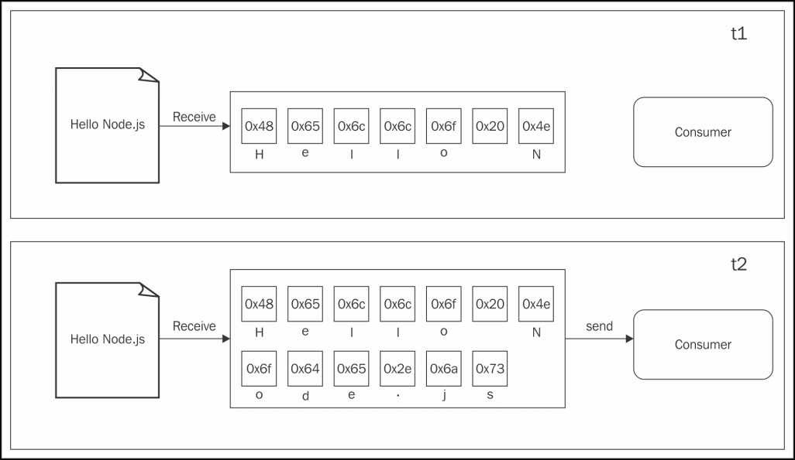
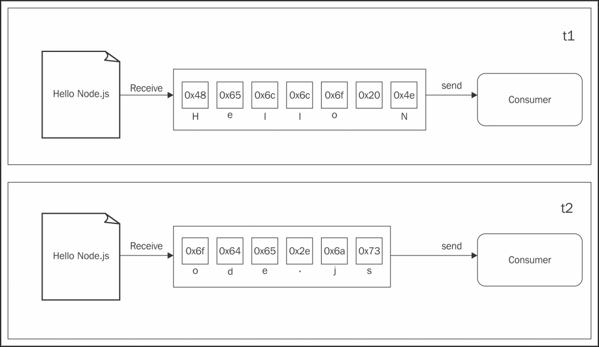
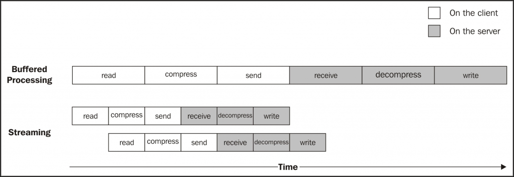

스트림은 Node.js의 가장 중요한 컴포넌트이며 패턴 중 하나이다.
커뮤니티 내에는 "모든 것에 스트림을!"이라는 모토가 있다.
이것만으로도 Node.js에서 스트림의 역할을 설명하기 충분하다.
Node.js 커뮤니티의 핵심 공헌자인 Dominic Tar는 스트림은 Node의 최고이면서 가장 오해하고 있는 개념으로 정의한다.
Node.js의 스트림이 매우 매력적인 이유는 여러 가지가 있다.
굳이 말하면, 성능이나 효율성과 같은 기술적 속성에 관한 것뿐만 아니라 그 세련됨과 Node.js 철학에 완벽하게 부합하는 방식에 관련된 것이다.

여기서는 다음과 같은 내용을 배운다.

-   Node.js에서 스트림이 중요한 이유
-   스트림 사용 및 생성
-   프로그래밍 패러다임으로서의 스트림 : I/O에 대한 것뿐만 아니라 여러 가지 다양한 상황에서 활용
-   파이프 패턴과 서로 다른 환경에서 스트림의 연결

---

## 스트림의 중요성

**Node.js와 같은 이벤트 기반 플랫폼에서 I/O를 처리하는 가장 효율적인 방법은 실시간으로 가능한 순간 바로 입력을 사용하고 어플리케이션에서 출력이 생성되는 즉시 내보내는 것이다.**

이 섹션에서는 Node.js 스트림에 대한 기초 소개와 장점을 설명할 것이다.

### 버퍼링 대 스트리밍

지금까지 보았던 거의 모든 비동기 API는 버퍼 모드를 사용한다.

입력 조작의 경우 버퍼 모드는 리소스로부터 오는 모든 데이터를 버퍼에 수집한다.
그리고 자원을 모두 읽어들인 후 콜백에 전달한다. 다음 그림에서 이 패러다임을 시각적으로 보여준다.


[참고 : https://subscription.packtpub.com/book/web_development/9781785885587/5/ch05lvl1sec25/discovering-the-importance-of-streams](https://subscription.packtpub.com/book/web_development/9781785885587/5/ch05lvl1sec25/discovering-the-importance-of-streams)

위의 그림 중 t1에서는 리소스로부터 일부 데이터를 받아 버퍼에 저장한다.
그리고 t2에서 데이터의 나머지인 다른 데이터 부분을 수신하여 읽기 동작이 완료되어 버퍼 전체가 소비자에게 전송되는 것을 볼 수 있다.

반면 스트림을 사용하면 리소스에서 도착하자마자 데이터를 처리할 수 있다.
이것을 다음 그림에서 보여준다.


[참고 : https://subscription.packtpub.com/book/web_development/9781785885587/5/ch05lvl1sec25/discovering-the-importance-of-streams](https://subscription.packtpub.com/book/web_development/9781785885587/5/ch05lvl1sec25/discovering-the-importance-of-streams)

이번 그림에서는 리소스로부터 각각의 데이터 덩어리가 수신되면 즉시 소비자에게 제공된다.
소비자는 이제 모든 데이터가 버퍼에 수집될 때까지 기다리지 않고 즉시 처리할 수 있다.

이 두가지 접근 방식의 차이점은 무엇일까? 두 가지로 요약할 수 있다.

-   공간 효율성
-   시간 효율성

그러나 Node.js 스트림에는 또 하나의 중요한 이점, 바로 **결합성**이 있다. 이제 어플리케이션을 디자인하고 작성하는 방식에 이러한 속성이 어떤 영향을 미치는지 살펴보자.

---

### 공간 효율성

무엇보다 스트림은 버퍼링하여 모든 데이터를 한꺼번에 처리하는 방식으로 불가능한 작업을 처리할 수 있다.
예를 들어, 수백 메가바이트(MB) 혹은 기가바이트(GB)의 매우 큰 파일을 읽는다고 생각해보자.
파일을 모두 읽은 후 커다란 버퍼를 반환하는 API를 사용하는 것은 확실히 좋은 생각이 아니다.
이런 큰 파일을 몇 개를 동시에 읽는다고 생각해보자.
우리의 어플리케이션은 금방 메모리가 부족하게 될 것이다.
그 외에도 V8 버퍼는 0x3FFFFFFF바이트(1GB가 약간 안됨) 보다 클 수 없다.
따라서 물리적인 메모리가 부족해지기 전에 이와 같은 벽에 부딪힌다.

#### 버퍼링된 API를 사용한 Gzipping(압축)

구체적인 예를 들기 위해 Gzip 형식을 사용하여 파일을 압축하는 간단한 커맨드 라인 인터페이스(CLI) 어플리케이션을 생각해 보자.
Node.js에서 버퍼를 사용하는 API를 가진 어플리케이션은 다음과 같다.

```javascript
const fs = require("fs");
const zlib = require("zlib");

const file = process.argv[2]; // 추후 설명 추가

fs.readFile(file, (err, buffer) => {
    zlib.gzip(buffer, (err, buffer) => {
        fs.writeFile(file + ".gz", buffer, err => {
            console.log("File successfully compressed");
        });
    });
});
```

이제 앞의 코드를 gzip.js에 저장하고 다음 명령을 사용하여 실행할 수 있다.

```
node gzip <파일경로>
```

아주 큰 파일을 선택한다면(1GB 보다 약간 더 크다고 치자) 다음과 같이 우리가 읽으려는 파일이 허용된 최대 버퍼의 크기보다 크다는 오류 메시지가 나타날 것이다.

```
RangeError: File size is greater than possible Buffer: 0x3FFFFFFF bytes
```

이것은 이미 예상되었던 것이며, 잘못된 접근 방식을 사용한 결과이다.

#### 스트림을 사용한 Gzipping

앞서 Gzip 어플리케이션을 수정하여 큰 파일로 작업을 하도록 하는 가장 간단한 방법은 스트리밍 API를 사용하는 것이다.
어떻게 그렇게 할 수 있는지 보기 위해서, 앞서 생성한 모듈의 내용을 다음 코드로 대체해보자.

```javascript
const fs = require("fs");
const zlib = require("zlib");
const file = process.argv[2];

fs.createReadStream(file)
    .pipe(zlib.createGzip())
    .pipe(fs.createWriteStream(file + ".gz"))
    .on("finish", () => console.log("File successfully compressed"));
```

> 위의 코드에서 .on()메소드를 실행할 수 있는 이유는, 이벤트를 내보내는 모든 객체는 EventEmitter의 인스턴스이다.

우리는 '이게 전부야?' 라고 생각할 것이다. 그렇다. 앞에서 말했듯이 스트림은 인터페이스뿐만 아니라 결합성이 훌륭하다.
따라서 깨끗하고 우아하며 간결한 코드의 작성이 가능하다.
좀 더 자세히 살펴보겠지만, 지금 당장은 모든 크기의 파일에 대해 프로그램이 이상적으로 일정한 메모리 사용률을 가지고 실행된다는 것을 깨닫는 것이다 중요하다.
직접 시도해보자.(하지만 큰 파일을 압축하는데는 시간이 걸릴 수 있다.)

---

#### 시간 효율성

이제 파일을 압축하고 원격의 HTTP 서버에 업로드 하는 어플리케이션의 경우를 생각해 보자.
원격 HTTP 서버는 압축을 풀어 파일 시스템에 저장한다.
클라이언트가 버퍼링되는 API를 사용하여 구현한다면, 업로드는 전체 파일을 읽어 압축한 경우에만 시작할 수 있다.
또한 압축 해제는 모든 데이터가 서버에 수신된 경우에만 시작할 수 있다.
똑같은 결과를 얻는 더 좋은 솔루션은 스트림을 사용하는 것이다.
**클라이언트 시스템에서 스트림을 사용하면 파일 시스템에서 데이터 덩어리를 읽는 즉시 압축하고 보낼 수 있다.**
반면 서버에서는 원격 피어(peer)에서 수신된 즉시 모든 덩어리를 압축 해제할 수 있다.
앞에서 언급한 프로그램을 서버 측에서부터 시작하여 이 내용을 살펴보자.

다음 코드를 포함하는 gzipReceive.js라는 모듈을 생성한다.

```javascript
const http = require('http')
const fs = require('fs')
const zlib = require('zlib')

const server = http.createServer((req, res) => {
    const filename = req.headers.filename;
    console.log('File request received: ' + filename);
    req.pipe(zlib.createGunzip()).pipe(fs.createWriteStream(filename)).on('finish', () => {
        res.writeHead(201, {'Content-Type': 'text/plain'})
        res.end('That's it\n')
        console.log(`File saved: ${filename}`);
    })
})

server.listen(3000, () => console.log('Listening'))
```

서버는 Node.js 스트림 덕택에 네트워크에서 데이터 덩어리를 수신하고 압축을 풀어 수신 즉시 이를 저장한다.
어플리케이션의 클라이언트 측은 gzipSend.js라는 모듈에 작성하며 다음과 같다.

```javascript
const fs = require("fs");
const zlib = require("zlib");
const http = require("http");
const path = require("path");
const file = process.argv[2];
const server = process.argv[3];

const options = {
    hostname: server,
    port: 3000,
    path: "/",
    method: "PUT",
    headers: {
        filename: path.basename(file),
        "Content-Type": "application/octet-stream",
        "Content-Encoding": "gzip"
    }
};

const req = http.request(options, res => {
    console.log("Server response: " + res.statusCode);
});

fs.createReadStream(file)
    .pipe(zlib.createGzip())
    .pipe(req)
    .on("finish", () => {
        console.log("File successfully sent");
    });
```

앞의 코드에서 우리는 파일에서 데이터를 읽기 위해 다시 스트림을 사용하여 파일 시스템에서 읽어들이자마자 각 데이터 덩어리를 압축하여 보낸다.

이제 어플리케이션을 시험해보기 위해 다음 명령을 사용하여 서버를 시작할 수 있다.

```
node gzipReceive
```

그런 다음 전송할 파일과 서버의 주소(예: localhost)를 지정하여 클라이언트를 시작할 수 있다.

```
node gzipSend <path to file> localhost
```

충분히 큰 파일을 선택하면 데이터가 클라이언트에서 서버로 흐르는 방식을 보다 쉽게 볼 수 있을 것이다.
그러나 버퍼링을 사용하는 API에 비해 데이터의 흐름에 있어 왜 이 패러다임이 더 효과적인지 명확히 하기 위해 그림을 보자.



[참고 : https://subscription.packtpub.com/book/web_development/9781785885587/5/ch05lvl1sec25/discovering-the-importance-of-streams](https://subscription.packtpub.com/book/web_development/9781785885587/5/ch05lvl1sec25/discovering-the-importance-of-streams)

파일이 처리될 때 일련의 순차 단계를 거치게 된다.

1. [Client] 파일 시스템에서 데이터를 읽는다.
2. [Client] 데이터를 압축한다.
3. [Client] 서버로 전송한다.
4. [Server] 클라이언트로부터 수신한다.
5. [Server] 데이터의 압축을 푼다.
6. [Server] 디스크에 데이터를 쓴다.

처리를 완료하려면 조립 라인과 같이 순서대로 각 단계를 끝까지 완료해야 한다.
앞의 그림에서 버퍼링되는 API를 사용하면 프로세스가 완전히 순차적이라는 것을 알 수 있다.
데이터를 압축하려면 먼저 전체 파일을 읽을 때까지 기다린 다음, 데이터를 보내기 위해서는 전체 파일이 읽히고 압축될 때까지 기다려야 한다.
대신 스트림을 사용하면 전체 파일을 읽을 때까지 기다리지 않고 첫 번째 데이터 덩어리를 수신하자마자 조립 라인이 시작된다.
더 놀라운 것은 데이터의 다음 덩어리가 사용 가능한 상태가 될 때, 이전 작업들이 완료될 때까지 기다릴 필요가 없다는 것이다.
대신 조립 라인이 병렬로 실행된다.
이것은 우리가 실행하는 각 작업이 비동기적이면서 Node.js에 의해 병렬로 실행될 수 있기 때문에 완벽하게 작동한다.
유일한 제약은 데이터 덩어리가 각 단계에 도착하는 순서가 보존되어야 한다는 것이다.
(이것은 Node.js 스트림이 우리를 대신해서 처리한다.)

앞의 그림에서 볼 수 있듯이 스트림을 사용하면 모든 데이터를 한꺼번에 읽고 처리하기 위해 시간을 낭비하지 않으므로 전체 프로세스의 시간이 단축된다.

---

#### 결합성

지금까지 살펴본 코드는 각기 완벽한 Node.js 스타일로 단일 기능을 담당하는 서로 다른 프로세스 유닛들을 연결할 수 있는 pipe() 메소드를 사용하여 어떻게 스트림을 구성할 수 있는지에 대한 개요를 보여주었다. 이는 스트림이 균일한 인터페이스를 가지며 API 측면에서 서로를 이해할 수 있기 때문에 가능하다.
**유일한 전제 조건은 파이프라인의 다음 스트림이 이전 스트림에 의해 생성되어 전달된 데이터 타입을 지원해야 한다는 것이다.**
이 데이터 타입에는 바이너리, 텍스트 또는 객체가 될 수 있다.

이 속성의 또 다른 예를 살펴 보기 위해, 앞에 작성한 gzipReceive/gzipSend 어플리케이션에 암호화 계층을 추가해 볼 수 있다.

이를 위해서는 파이프라인에 다른 스트림, 즉 crypto.createCipher()에 의해 리턴된 스트림을 추가하여 클라이언트를 업데이트하면 된다. 결과 코드는 다음과 같다.

```javascript
const crypto = require("crypto");
// ...
fs.createReadStream(file)
    .pipe(zlib.createGzip())
    .pipe(crypto.createCipher("aes192", "a_shared_secret"))
    .pipe(req)
    .on("finish", () => console.log("File successfully sent"));
```

비슷한 방식으로 데이터를 압축 해제하기 전에 데이터를 복호화하도록 서버를 업데이트 할 수 있다.

```javascript
const crypto = require("crypto");
// ...
const server = http.createServer((req, res) => {
    // ...
    req.pipe(crypto.createDecipher("aes192", "a_shared_secret"))
        .pipe(zlib.createGunzip())
        .pipe(fs.createWriteStream(filename))
        .on("finish", () => {
            /* ... */
        });
});
```

큰 수고 없이(몇 줄의 코드 만으로) 어플리케이션에 암호화 레이어를 추가했다.
우리는 이미 존재하는 파이프라인에 변환 스트림을 끼워 넣어 스트림을 재사용하였다.
비슷한 방법으로, 우리가 레고 블록을 가지고 노는 것처럼 다른 스트림을 추가하여 결합할 수 있다.

분명히 이 접근법의 주요 장점은 재사용성이지만, 지금까지 제시한 코드에서 알 수 있듯이 스트림을 사용하면 더 깨끗하고 모듈화된 코드를 작성할 수 있다. 이러한 이유로 스트림은 순수한 I/O를 다루는 것뿐만 아니라 코드를 단순화하고 모듈화하는 수단으로 사용되기도 한다.
