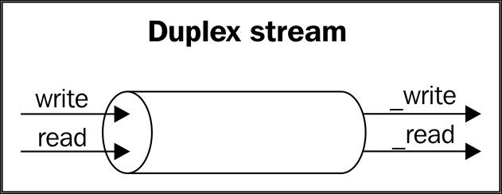
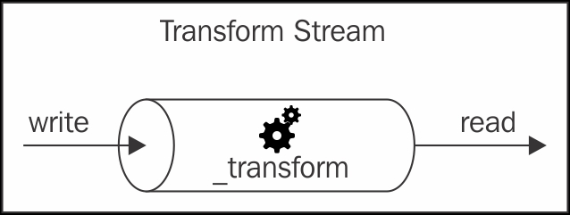

## 스트림 시작하기

Node.js의 핵심 모듈을 비롯한 모든 곳에서는 스트림을 사용한다.
이제 스트림을 더 자세히 알아보자

### 스트림의 구조

Node.js에서 모든 스트림은 스트림의 코어 모듈에서 사용할 수 있는 네 가지 추상 클래스 중 하나의 구현체이다.

-   stream.Readable
-   stream.Writable
-   stream.Duplex
-   stream.Transform

각 스트림 클래스는 EventEmitter의 인스턴스이기도 하다. 실제로 스트림은 Readable 스트림에서 읽기가 끝났을 때 발생하는 end, 무엇인가 잘못되었을 때 발생하는 error와 같은 여러 가지 유형의 이벤트를 제공한다.

> 간략하게 하기 위해 예제에서는 적절한 오류관리를 생략하는 경우가 많다.
> 그러나 상용 프로그램에서는 항상 모든 스트림에 대한 오류 이벤트 수신기를 등록하는 것이 좋다.

**스트림이 매우 유연한 이유 중 하나는 바이너리 데이터를 처리할 뿐만 아니라 거의 모든 JavaScript의 값을 처리할 수 있다는 것이다.**
실제로 두 가지 동작 모드를 지원할 수 있다.

-   바이너리 모드 : 이 모드는 데이터가 버퍼 또는 문자열과 같은 덩어리(chunk) 형태로 스트리밍되는 모드이다.
-   객체 모드 : 이 모드는 스트리밍 데이터가 일련의 별도 객체들로 취급되는 것이다(거의 모든 JavaScript 값을 사용할 수 있다).

이 두가지 동작 모드를 사용하면 I/O 뿐만 아니라 처리 단위를 기능 단위로 우아하게 구성할 수 있다.

---

### Readable 스트림

Readable 스트림은 데이터 소스를 나타낸다. Node.js에서는 스트림 모듈에서 사용할 수 있는 Readableabstract 클래스를 사용하여 구현된다.

#### 스트림에서 읽기

Readable 스트림에서 데이터를 수신하는 방법에는 non-flowing, flowing 이렇게 두 가지가 있다. 이 모드들을 좀 더 자세히 살펴보겠다.

##### **_non_flowing 모드_**

Readable 스트림에서 읽기의 기본 패턴은 새로운 데이터를 읽을 준비가 되었다는 신호인 readable 이벤트에 대하여 listener를 등록하는 것이다.
그런 다음 루프에서 내부의 버퍼가 비워질 때까지 모든 데이터를 읽는다.
이것은 내부 버퍼에서 동기식으로 데이터 덩어리(chunk)를 읽고 Buffer 또는 String 객체를 반환하는 read() 메소드를 사용하여 수행할 수 있다.
read() 메소드는 다음과 같은 특징을 가진다.

```
readable.read([size])
```

이 접근 방식을 사용하여 필요할 때 즉시 스트림으로부터 명시적으로 데이터를 가져올 수 있다.
readStdin.js라는 새로운 모듈을 만들어 보면서 이것이 어떻게 동작하는지 알아보자.
이 모듈은 표준 입력으로부터 읽고 표준 출력으로 그대로 되돌려주도록 간단하게 구현된 프로그램이다.

```javascript
process.stdin.on('readable', () => {
    let chunk;
    console.log('New data available');
    while((chunk = process.stdin.read()) !== null) {
        console.log(`Chunk read: (${chunk.length}) "${chunk.toString()})`
    }
})
.on('end', () => process.stdout.write('End of stream'))
```

read() 메소드는 Readable 스트림의 내부 버퍼에서 데이터를 읽어들이는 동기 작업이다.
스트림이 바이너리 모드로 동작하고 있는 경우, 기본적으로 반환되는 데이터는 Buffer 객체이다.

> 바이너리 모드로 동작하는 Readable 스트림에서 스트림의 setEncoding(encoding)을 호출하여 buffer를 대신해서 string을 읽을 수 있으며, 유효한 인코딩 형식(예를 들어, utf8)을 제공할 수 있다.

데이터는 readable 리스너에서 독점적으로 읽을 수 있다.
리스너는 새로운 데이터가 읽기 가능하게 되는 즉시 호출된다.
read() 메소드는 내부 버퍼에 더 이상 사용할 수 있는 데이터가 없을 때 null을 반환한다.
이 경우 다시 읽을 수 있다는 이벤트 또는 스트림의 끝을 알리는 end 이벤트가 발생할 때까지 기다려야 한다.
스트림이 바이너리 모드에서 동작할 때는 size 값을 read() 메소드에 전달하여 특정 양의 데이터를 읽어들일 것이라고 지정할 수 있다.
특히 특정 형식의 네트워크 프로토콜이나 특정 데이터 형식으로 분석하는 구현에 유용하다.

이제 readStdin 모듈을 실행하여 시험할 준비가 되었다.
콘솔에 몇 가지 문자를 입력하고 Enter 키를 눌러서 다시 표준 출력으로 에코된 데이터를 확인한다.
스트림을 종료하고 적절한 종료 이벤트를 만들기 위해서는 EOF(End-Of-File) 문자를 전달해야 한다.(Windows에서는 Ctrl + Z, Linux에서는 Ctrl + D)

프로그램을 다른 프로세스와 연결할 수도 있다. 파이프 연산자('|')를 사용하면 프로그램의 표준 출력을 다른 프로그램의 표준 입력으로 리다이렉션 할 수 있다.
예를 들어 다음과 같은 명령을 실행할 수 있다.

```
cat <path to a file> | node readStdin
```

이것은 스트리밍 패러다임이 작성된 언어와는 관계없이 프로그램 간의 통신을 할 수 있게 해주는 보편적인 인터페이스임을 보여주는 좋은 예이다.

##### **_Flowing 모드_**

스트림으로부터 데이터를 읽는 또 다른 방법은 data 이벤트에 리스너를 등록하는 것이다.
이것은 스트림을 **Flowing 모드**로 전환한다. 여기서 데이터는 read()를 사용하여 꺼내지 않고 데이터가 도착하자마자 해당 리스너에 전달된다. 예를 들어, 앞서 만든 readStdin 프로그램은 Flowing 모드에서는 다음과 같이 된다.

```javascript
process.stdin
    .on("data", chunk => {
        console.log("New data available");
        console.log(`Chunk read: (${chunk.length}) "${chunk.toString()}"`);
    })
    .on("end", () => process.stdout.write("End of stream"));
```

Flowing 모드는 **이전 버전의 스트림 인터페이스(Stream1이라고도 함)의 상속이며, 데이터 흐름 제어를 위한 유연성이 떨어진다.** Stream2 인터페이스의 도입으로 Flowing 모드는 기본 작동 모드가 아니다.
이를 사용하려면 data 이벤트에 리스너를 등록하거나 resume() 메소드를 명시적으로 호출해야 한다.
스트림에서 data 이벤트 발생을 일시적으로 중지시키기 위해서는 pause() 메소드를 호출하는데, 이 경우 들어오는 데이터는 내부 버퍼에 캐시된다.

> pause()를 호출한다 해도 스트림이 다시 non-flowing 모드로 전환되지 않는다.

#### Readable 스트림 구현하기

스트림에서 데이터를 읽는 방법을 익혔으므로, 다음 단계로 새로운 Readable 스트림을 구현하는 방법을 알아보자.
이렇게 하면 stream.Readable의 prototype을 상속한 새로운 클래스를 만들어야 한다.
실제 stream은 아래와 같은 특성을 가지는 \_read() 메소드의 구현체를 제공해야 한다.

```
readable._read(size)
```

Readable 클래스는 내부적으로 push() 메소드를 사용하여 내부 버퍼를 채우는 \_read() 메소드를 호출한다.

```
readable.push(chunk)
```

> read()는 스트림의 소비자에 의해 호출되는 메소드이고, \_read() 스트림의 서브 클래스에 의해 구현되며 직접 호출해서는 안된다는 점을 주의한다. 밑줄로 시작하는 함수는 일반적으로 해당 함수가 public이 아니므로 직접 호출해서는 안된다는 의미를 가진다.

새로운 Readable 스트림을 어떻게 구현하는지 보여주기 위해 임의의 문자열을 생성하는 스트림을 구현해 볼 수 있다.
문자열 생성기의 코드를 포함하는 randomStream.js라는 새로운 모듈을 만든다.

```javascript
const stream = require("stream");
const Chance = require("chance");
const chance = new Chance();

class RandomStream extends stream.Readable {
    constructor(options) {
        super(options);
    }

    _read(size) {
        const chunk = chance.string();
        console.log(`Pushing chunk of size: ${chunk.length}`);
        this.push(chunk, "utf8");
        if (chance.bool({ likelihood: 5 })) {
            this.push(null);
        }
    }
}

module.exports = RandomStream;
```

파일의 맨 위에서 의존성들을 로드한다. 숫자에서 문장 전체의 문자열에 이르기까지 모든 종류의 무작위 값을 생성하는 라이브러리인 chance라는 npm 모듈을 로드한다는 점을 제외하면 특별한 것은 없다.

다음 단계는 RandomStream이라는 새로운 클래스를 생성하고 stream.Readable을 부모로 지정하는 것이다.
앞의 코드에서 부모 클래스의 생성자를 호출하여 내부 상태를 초기화하는데 입력된 option 인자를 전달한다.
option 객체를 통해서 전달할 수 있는 변수들은 다음과 같다.

-   버퍼를 문자열로 변환하는데 사용되는 encoding 변수(기본값은 null)
-   객체 모드를 정하는 플래그(objectMode의 기본값은 false)
-   내부 버퍼에 저장되는 데이터의 상한선, 이후 소스로부터 더 이상 데이터를 읽지 않는다.(highWatermark의 기본값은 16K)

좋다. 이제 \_read() 메소드를 설명해보자.

-   이 함수는 chance를 사용하여 임의의 문자열을 생성한다.
-   생성된 문자열을 내부 읽기 버퍼에 푸시한다. String을 푸시(push)하기 때문에 인코딩(utf8)을 지정한다(데이터 덩어리가 단순히 이진 버퍼인 경우에는 필요하지 않다)
-   이 함수는 또 5%의 확률로 내부 버퍼에 EOF 상황, 다시 말해 스트림의 끝을 나타내는 null을 내부 버퍼에 푸시하여 스트림을 무작위적으로 종료시킨다.

\_read() 함수에 입력된 size 인자는 권고 매개변수기 때문에 무시되는 것을 볼 수 있다.
우리는 사용 가능한 모든 데이터를 간단하게 푸시할 수 있었지만, 동일한 호출 내에서 여러 번의 푸시가 있을 경우 push() 함수가 false를 반환하는가를 확인해야 하는데, 이것은 내부 버퍼가 highWatermark 제한에 도달했기 때문에 더 많은 데이터를 추가하는 것을 중지하라는 것을 의미한다.

지금까지는 RandomStream을 위한 것이다. 새로운 모듈을 사용할 준비가 되었다.
여기서 generate Random.js라는 새로운 모듈을 만들어 RandomStream 객체를 인스턴스화하고 그 인스턴스에서 데이터를 획득해보자.

```javascript
const RandomStream = require("./randomStream");
const randomStream = new RandomStream();

randomStream.on("readable", () => {
    let chunk;
    while ((chunk = randomStream.read() !== null)) {
        console.log(`Chunk received: ${chunk.toString()}`);
    }
});
```

이제 새로운 우리만의 스트림을 사용해 볼 수 있다. 평소처럼 generateRandom 모듈을 실행한 후에 화면에 흐르는 임의의 문자열 집합을 관찰하기만 하면 된다.

---

#### Writable 스트림

Writable 스트림은 데이터의 목적지를 나타낸다. Node.js에서는 stream 모듈에서 사용할 수 있는 Writable 추상 클래스르 사용하여 구현한다.
Node.js에서는 stream 모듈에서 사용할 수 있는 Writable 추상 클래스를 사용하여 구현한다.

##### 스트림에 쓰기

일부 데이터를 Writable 스트림으로 밀어내는 작업은 매우 간단하다. 그저 아래와 같은 특징을 가지는 write() 메소드를 사용하면 된다.

```
writable.write(chunk, [encoding], [callback])
```

인코딩 인자는 선택적인 사항이며, chunk가 String일 경우 지정할 수 있다.(기본값은 utf8이며, chunk가 Buffer인 경우 무시된다).
대신 콜백 함수는 chunk가 하위 자원으로 Flush되면 호출되는데, 이 또한 선택적인 사항이다.

더 이상 스트림에 기록할 데이터가 없다는 신호를 보내기 위해서는 end() 메소드를 사용한다.

```
writable.end([chunk], [encoding], [callback])
```

end() 메소드를 사용하여 마지막 데이터를 전달할 수 있는데, 이 경우 콜백 함수는 스트림에 쓴 모든 데이터가 하위 리소스로 플러시 되었을 때 발생하는 finish 이벤트에 리스너를 등록하는 것과 같다.

이제 임의의 일련의 문자열을 출력하는 간단한 HTTP 서버를 만들어 어떻게 동작하는지 보자.

```javascript
const Chance = require('chance');
const chance = new Chance();

require('http').createServer((req, res) => {
    res.writeHead(200, {'Content-Type': 'text/plain'});
    while(chance.bool({likelihood: 95})) {
        res.write(chance.string() + '\n)'
    }
    res.end('\nThe end...\n')
    res.on('finish', () => console.log('All data was sent'));
}).listen(8080, () => console.log('Listening on http://localhost:8080'))
```

여기서 만든 HTTP 서버는 http.ServerResponse의 인스턴스면서 Writable 스트림인 res 객체에 데이터를 쓴다.
아래는 무슨 일이 일어나는지에 대한 설명이다.

1. 먼저 HTTP 응답 헤더를 작성한다. writableHead()는 Writable 인터페이스의 일부가 아니다. 이것은 http.ServerResponse 클래스에 의해 노출된 보조 메소드이다.
2. 5%의 확률로 종료되는 루프를 시작한다(전체 루프의 95%는 chance.bool()에서 true를 반환한다.)
3. 루프 내에서 임의의 문자열을 스트림에 쓴다.
4. 루프가 끝나면 스트림에서 end()를 호출하여 더 이상 쓸 데이터가 없음을 알린다. 또한 스트림을 끝내기 전에 쓸 최종 문자열을 전달한다.
5. 마지막으로 finish 이벤트에 대한 리스너를 등록하는데, 이 이벤트는 모든 데이터가 하위 소켓에 플러시 될 때 발생한다.

이 모듈을 entropyServer.js라고 부르기로 하고, 저장한 후 실행한다. 서버를 테스트하기 위해서 브라우저에 http://localhost:8080을 입력하거나, 다음과 같이 명령창에서 curl을 사용한다.

```
curl localhost:8080
```

이 시점에서 서버는 접속한 HTTP 클라이언트에 임의의 문자열을 보내기 시작한다(일부 브라우저는 데이터를 버퍼링할 수 있어 스트리밍 동작이 분명히 보이지 않을 수도 있다.)

##### 백프레셔(Back-pressure)

실제 파이프 시스템에서 흐르는 액체와 마찬가지로 Node.js 스트림은 스트림이 소비하는 것보다 더 빠르게 데이터를 쓸 경우 병목 현상이 발생할 수 있다.
이를 해결하기 위한 메커니즘은 들어오는 데이터를 버퍼링하는 것이다.
그러나 스트림이 writer에 피드백을 주지 않는다면, 내부 버퍼에 점점 더 많은 데이터가 축적되어 원치 않는 수준의 메모리 사용을 초래하게 될 수 있다.
이런 일이 발생하지 않도록 내부 버퍼가 highWartermark 제한을 초과하면 writable.write()는 false를 반환한다. write() 메소드가 false를 반환하면 어플리케이션에서는 더 이상의 데이터를 쓰지 말아야 한다.
버퍼가 비워지면 drain 이벤트가 발생하여 다시 쓰기를 시작해도 시작해도 좋다는 것을 알린다.
이 메커니즘을 **백프레셔(back-pressure)** 라고 한다.

> 이 섹션에서 설명한 메커니즘은 Readable 스트림에도 유사하게 적용된다.
> 실제로 Readable 스트림에도 백프레셔가 존재하며 \_read() 내부에서 호출되는 push() 메소드가 false를 반환하면 발동한다.
> 그러나 스트림 구현체들의 특성에 따른 문제로, 여기서 자세히 다루지는 않는다.

전에 작성한 엔트로피 서버를 수정함으로써 Writable 스트림의 백프레셔를 처리하는 방법을 알아볼 수 있을 것이다.

```javascript
const Chance = require("chance");
const chance = new Chance();

require("http")
    .createServer((req, res) => {
        res.writeHead(200, { "Content-Type": "text/plain" });

        function generateMore() {
            //[1]
            while (chance.bool({ likelihood: 95 })) {
                let shouldContinue = res.write(
                    chance.string({ length: 16 * 1024 - 1 }) // [2]
                );

                if (!shouldContinue) {
                    //[3]
                    console.log("Backpressure");
                    return res.once("drain", generateMore);
                }
            }
            res.end("\nThe end...\n", () => console.log("All data was sent"));
        }
        generateMore();
    })
    .listen(8080, () => console.log("Listening on http://localhost:8080"));
```

앞선 코드에서 가장 중요한 단계는 다음과 같이 요약할 수 있다.

1. generateMore() 라는 함수로 메인 로직을 감쌌다.
2. 백프레셔를 받을 가능성을 높이기 위해 데이터 덩어리의 크기를 16KB-1Byte 늘렸다.
   이는 highWartermark의 기본값에 매우 가까운 값이다.
3. 데이터 덩어리를 작성한 후 res.write()의 리턴 값을 확인한다. false를 받으면 내부 버퍼가 가득 차서 더 이상 데이터를 쓸 수 없음을 의미한다. 이 경우 함수에서 빠져 나가고 drain 이벤트가 발생할 때마다 쓰기 작업을 다시 등록한다.

이제 서버를 다시 실행하고 curl을 사용하여 클라이언트 요청을 생성하면 서버가 하위 소켓보다 빠른 속도, 즉 매우 빠른 속도로 데이터를 생성하기 때문에 얼마간의 백프레셔가 발생할 확률이 높다.

##### Writable 스트림 구현

stream.Writable의 프로토타입(prototype)을 상속받아, \_write() 함수를 구현하여 새로운 Writable 스트림을 구현할 수 있다. 구현하면서 세부 사항에 대한 설명을 바로 해보도록 하자.

아래와 같은 형식으로 객체를 받는 Writable 스트림을 작성해 보겠다.

```javascript
    {
    path: <path to a file>,
    content: <string or buffer>
    }
```

이 객체들 각각에 대해 우리의 스트림은 주어진 경로에 생성된 파일에 내용을 저장해야 한다.
스트림의 입력은 문자열이나 버퍼가 아닌 객체라는 것을 즉시 알 수 있다.
이는 스트림이 object 모드에서 동작해야 함을 의미한다.

이 모듈을 toFileStream.js 라고 부르겠다.

```javascript
const stream = require("stream");
const fs = require("fs");
const path = require("path");
const mkdirp = require("mkdirp");
class ToFileStream extends stream.Writable {
    constructor() {
        super({ objectMode: true });
    }

    _write(chunk, encoding, callback) {
        mkdirp(path.dirname(chunk.path), err => {
            if (err) {
                return calback(err);
            }
            fs.writeFile(chunk.path, chunk.content, callback);
        });
    }
}
module.exports = ToFileStream;
```

첫 번째 단계로, 우리가 사용할 모든 의존성을 로드한다. 우리는 mkdirp 모듈을 필요로 하며, 이는 이전 장에서 알 수 있듯이 NPM을 통해 설치되어 있어야한다.

stream.Writable을 확장한 새로운 클래스를 만들었다.

내부 상태를 초기화하기 위해 부모의 생성자를 호출해야한다.
스트림이 object 모드로 동작하도록 지정하기 위해 options 객체도 함께 제공한다. stream.Writable에서 사용할 수 있는 다른 옵션들은 다음과 같다.

-   hightWaterMark(기본값은 16K이다): 이것은 백프레셔의 한도를 제어한다.
-   decodeStrings(기본값은 true): 이것은 \_write() 메소드에 전달되기 전에 바이너리 버퍼 내 문자열에 대한 디코딩을 자동으로 활성화 시킨다. 이 옵션은 object 모드에서는 무시된다.

끝으로 \_write() 메소드를 보자.
보다시피, 이 메소드는 데이터 덩어리(chunk), 인코딩(바이너리 모드면서 스트림 옵션 decodeStrings가 false로 설정된 경우에만 의미가 있다.)을 인자로 받는다.
또한, 이 메소드는 작업이 완료될 때 호출해야 하는 콜백 함수를 허용하고 있다.

작업 결과를 전달할 필요는 없지만, 필요한 경우 스트림에서 error 이벤트를 발생시키는 오류를 전달할 수 있다.

이제 우리가 만든 스트림을 빌드하기 위해 writeToFile.js와 같은 이름으로 새로운 모듈을 만들고 스트림에 대한 몇 가지 쓰기 작업을 수행해 볼 수 있다.

```javascript
const ToFileStream = require("./toFileStream.js");
const tfs = new ToFileStream();

tfs.write({ path: "file1.txt", content: "Hello" });
tfs.write({ path: "file2.txt", content: "Node.js" });
tfs.write({ path: "file3.txt", content: "Streams" });
tfs.end(() => console.log("All files created"));
```

여기까지 첫 번쨰 사용자 정의 Writable 스트림을 만들고 사용해 보았다.
평소와 같이 새 모듈을 실행하여 출력을 확인하면 실행 후 3개의 파일이 생성될 것이다.

---

#### 양방향(Duplex) 스트림

양방향 스트림은 Readable과 Writable 모두가 가능한 스트림이다. 이 것은 소켓처럼 데이터 소스와 데이터 목적지를 모두 가지는 항목을 다룰 때 유용하다.
양방향 스트림은 stream.Readable 및 strea.Writable의 메소드를 상속하기 때문에 그 기능들이 전혀 새로운 것이 아니다.
즉, 우리는 데이터를 read() 또는 write() 하거나 readable이나 drain 이벤트를 모두 수신할 수 있다.

사용자 정의 이중 스트림을 생성하려면, \_read() 및 \_write() 메소드를 구현해야 한다.
Duplex() 생성자에 전달되는 options 객체는 내부적으로 Readable 및 Writable 모두의 생성자에 전달된다. option는 allowHalfOpen(기본값은 true)이라는 새로운 매개변수를 추가하면 나머지는 이전의 섹션에서 설명한 것과 동일하다.
allowHalfOpen을 false로 설정시 스트림의 한쪽이 종료되면 두 쪽(Readable과 Writable) 모두가 종료된다.

> 양방향 스트림을 한 쪽에서는 object 모드로, 다른 한쪽에서는 바이너리 모드로 작업하려 한다면, 스트림 생성자에 다음 속성을 수동으로 설정해야 한다.
>
> ```
> this._writableState.objectMode
> this._readableState.objectMode
> ```

---

#### Transform 스트림

Transform 스트림은 데이터 변환을 처리하도록 설계된 특별한 종류의 이중 스트림이다.

간단한 양방향 스트림에서는 스트림에서 읽은 데이터와 스트림에 쓰는 데이터 사이에 직접적인 관계가 없다(적어도 스트림에서 이 관계는 논의할 필요도 없다).
원격의 피어와 데이터를 송수신하는 TCP 소켓에 대해 생각해 보자.
소켓은 입력과 출력 사이에 어떠한 관계도 인식하지 못한다.
아래 그림은 양방향 스트림에서 데이터의 흐름을 보여준다.


[링크 : https://subscription.packtpub.com/book/web_development/9781785885587/5/ch05lvl1sec26/getting-started-with-streams](https://subscription.packtpub.com/book/web_development/9781785885587/5/ch05lvl1sec26/getting-started-with-streams)

다른 한편으로, Transform 스트림은 Writable 쪽에서 받은 각 데이터들에게 어떤 종류의 변형을 적용한 후에 변형된 데이터들을 Readable쪽에서 사용할 수 있도록 한다.
아래 그림은 데이터가 Transform 스트림에서 어떻게 흐르는지 보여준다.


[링크 : https://subscription.packtpub.com/book/web_development/9781785885587/5/ch05lvl1sec26/getting-started-with-streams](https://subscription.packtpub.com/book/web_development/9781785885587/5/ch05lvl1sec26/getting-started-with-streams)

외부에서 볼 때 Transform 스트림의 인터페이스는 양방향 스트림(Duplex stream)의 인터페이스와 동일하다.
그러나 새로운 양방향 스트림(Duplex stream)을 만들 때는 \_read() 및 \_write() 메소드를 구현해 제공해야 하지만, 새로운 Transform 스트림을 구현할 때는 transform()과 \_flush() 메소드를 추가로 작성해야 한다.

예제로 새로운 Transform 스트림을 만들어보자.

---

#### Transform 스트림 구현

주어진 모든 문자열을 대체하는 Transform 스트림을 구현해 보자.
이렇게 하려면 replaceStream.js라는 새 모듈을 만들어야 한다.

```javascript
const stream = require("stream");
const util = require("util");

class ReplaceStream extends stream.Transform {
    constructor(searchString, replaceString) {
        super();
        this.searchString = searchString;
        this.replaceString = replaceString;
        this.tailPiece = "";
    }
    _transform(chunk, encoding, callback) {
        const pieces = (this.tailPiece + chunk).split(this.searchString); //[1]
        const lastPiece = pieces[pieces.length - 1];
        const tailPieceLen = this.searchString.length - 1;

        this.tailPiece = lastPiece.slice(-tailPieceLen);
        pieces[pieces.length - 1] = lastPiece.slice(0, -tailPieceLen);

        this.push(pieces.join(this.replaceString)); //[3]
        callback();
    }

    _flush(callback) {
        this.push(this.tailPiece);
        callback();
    }
}

module.exports = ReplaceStream;
```

언제나처럼 우리는 종속성에서 출발하여 모듈 빌드를 시작할 것이다.
이번에는 제 3자의 모듈을 사용하지 않을 것이다.

그 다음 stream.Transform 기본 클래스를 확장하여 새로운 클래스르 만들 것이다.
클래스의 생성자는 searchString과 replaceString이라는 두 개의 인자를 받는다.
이름에서 유추할 수 있듯이 찾을 문자열과 찾은 문자열을 교체할 문자열을 정의하는 것이다.
또한, \_transform() 메소드에서 사용할 내부 변수 tailPiece를 초기화 한다.

이제 새로운 클래스의 핵심인 \_transform() 메소드에 대해 알아보자.
transform() 메소드는 Writable 스트림의 \_write() 메소드와 거의 동일한 형태를 가지고 있지만, 하위 리소스에 데이터를 쓰는 대신 Readable 스트림의 \_read() 메소드에서 한 것과 마찬가지로 this.push()를 사용하여 내부 버퍼에 푸시한다.
이렇게 하면 Transform 스트림의 양측이 실제로 어떻게 연결되는지 확인할 수 있다.

ReplaceStream의 \_transform() 메소드는 알고리즘 구현의 핵심이다.
버퍼에서 문자열을 검색하여 치환하는 것은 어려운 일이 아니지만, 데이터가 스트리밍 될 때는 전혀 다른 이야기가 되는데, 치환 가능한 검색 항목이 여러 데이터 덩어리(chunk)에 분산되어 있을 수 있다.
이 코드가 수행하는 절차를 설명하자면 다음과 같다.

1. 알고리즘은 searchString 함수를 분리자(separator)로 사용하여 데이터 덩어리를 분할(split)한다.
2. 그런 다음 분할 연산에 의해 생성된 배열의 마지막 항목에서 searchString.length - 1 만큼의 문자열을 추출한다. 결과는 변수 tailpiece에 저장되고 다음 데이터 덩어리의 앞에 덧붙여진다.
3. 마지막으로 split()에서 생성된 모든 항목들은 replaceString을 분리자로 결합되어 내부의 버퍼로 푸시된다.

스트림이 끝나면 마지막 tailPiece 변수가 내부 버퍼에 푸시되지 않은 상태일 수 있다.
이것이 바로 \_flush() 메소드의 용도이다. 스트림이 끝나기 직전에 호출되며, 스트림을 완전히 끝내기 전에 마지막으로 스트림을 마무리 하거나, 남은 데이터를 푸시할 수 있는 마지막 기회이다.

\_flush() 메소드는 모든 작업이 완료되면 호출하여 스트림이 종료되는 콜백을 인자로 받는다.
이렇게 ReplaceStream 클래스를 완성하자.

이제 새로운 스트림을 사용해 보자.
일정한 데이터를 쓴 다음 변환된 결과를 읽는 replaceStreamTest.js라는 모듈을 만들 수 있다.

```javascript
const ReplaceStream = require("./replaceStream");

const rs = new ReplaceStream("World", "Node.js");
rs.on("data", chunk => console.log(chunk.toString()));

rs.write("Hello W");
rs.write("orld!");
rs.end();
```

스트림을 좀 더 현실적으로 동작하도록 두 개의 서로 다른 데이터 덩어리(chunk)에 걸쳐 검색어(World)를 나누어 놓는다. 그런 다음 flowing 모드를 사용하여, 동일한 스트림에서 읽어들여 변환된 데이터 덩어리를 출력한다. 앞의 프로그램을 실행하면 다음과 같은 결과가 나온다.

```
Hel
lo Node.js
!
```

> 우리가 기억할 만한 다섯 번째 유형의 스트림이 있다. 바로 PassThrough이다. 앞서 언급한 다른 스트림 클래스들과 달리 PassThrough는 추상 클래스가 아니며, 다른 메소드를 구현할 필요가 없이 바로 인스턴스화 될 수 있다.
> 실제로 변환을 적용하지 않고 모든 데이터 덩어리(chunk)를 출력하는 Transform 스트림이다.

---

#### 파이프를 통한 스트림 연결

Unix의 파이프 개념은 Douglas Mcllroy에 의해 고안되었다.
이것은 프로그램의 출력을 다음 프로그램의 입력에 연결할 수 있게 한다.

```
echo Hello World! | sed s/World/Node.js/ g
```

위의 명령에서 echo가 Hello World!를 표준 출력에 기록한 다음, sed 명령의 표준 입력으로 리다이렉션된다(파이프 연산자 때문에), sed는 모든 World를 Node.js로 대체하고 결과를 표준 출력(이번에는 콘솔)으로 내보낸다.

비슷한 방식으로, Node.js 스트림은 아래와 같은 형식의 인터페이스를 가지는 Readable 스트림의 pipe() 메소드를 사용하여 서로 연결할 수 있다.

```
readable.pipe(writable, [options])
```

직관적으로 알 수 있듯이, pipe() 메소드는 readable 스트림에서 만들어진 데이터를 취하여 주어진 write 스트림으로 보내준다.
또한 readable 스트림이 end 이벤트를 전달하면 자동으로 writable 스트림은 종료된다.
piep() 메소드는 인자로 전달된 writable 스트림을 반환하므로 해당 스트림이(Duplex 또는 Transform 스트림처럼) Readable까지 가능하다면 연결된 호출을 만들어 낼 수 있다.

두 개의 스트림을 함께 pipe로 연결하면 흡착(suction)이 생성되어 데이터가 자동으로 writable 스트림으로 흐르게 되어 read() 또는 write()를 호출할 필요가 없다.
중요한 것은 자동으로 처리되기 때문에 더 이상 백프레셔를 제어할 필요가 없다는 것이다.

간단한 예제를 만들기 위해 replace.js라는 새로운 모듈을 만들어 표준 입력에서 텍스트 스트림을 가져와 치환을 적용한 다음, 이 데이터를 표준 출력으로 내보낸다.

```javascript
const ReplaceStream = require("./replaceStream");
process.stdin
    .pipe(new ReplaceStream(process.argv[2], process.argv[3]))
    .pipe(process.stdout);
```

위 프로그램은 표준 입력으로부터 오는 데이터를 ReplaceStream으로 파이프한 다음, 다시 표준 출력으로 되돌려 준다. 이제 이 작은 어플리케이션을 사용하기 위해 Unix 파이프를 활용하여 다음 예제와 같이 일부 데이터를 표준 입력으로 리다이렉션 할 수 있다.

```
echo Hello World! | node replace World Node.js
```

이렇게 하면 다음과 같이 출력된다.

```
Hello Node.js
```

이 간단한 예제를 통해 스트림(특히 텍스트 스트림)은 보편적인 인터페이스이며, 파이프는 이러한 모든 인터페이스를 구성하고 서로 연결하는 마법과 같은 방법이라는 것을 알 수 있다.

> 오류 이벤트는 파이프라인을 통해 자동으로 전파되지 않는다. 예를 들어 다음과 같은 일부의 코드를 본다.
>
> ```javascript
> stram1.pipe(stream2).on("error", function() {});
> ```
>
> 이 파이프라인에서 우리는 stream2에서 발생한 에러만 캐치할 수 있다.
> 즉, 만일 우리가 stream1에서 발생하는 에러도 캐치하고자 한다면, 또 다른 error 리스너를 stream1에 직접 연결해야 한다는 것이다.
> 나중에 이 불편함을 줄이는 패턴(스트림 결합 - combining stream)을 보게 될 것이다.
> 또한 타겟 스트림이 오류를 발생시키면 자동으로 소스 스트림에서 데이터가 흘러 들지 않아 파이프라인이 중단된다.

---

#### 스트림 작업을 위한 Through와 from

지금까지 사용자정의 스트림을 작성한 방식은 Node의 방식을 정확히 따르고 있지 않는다.
실제로 기본 스트림 클래스를 상속하게 되면, 최소 면적의 원칙(small surface area principle)을 위반하고 일부 복잡한 코드를 필요로 하게 된다.
이것은 스트림이 잘못 설계되었다는 것이 아니다.
실제로 Node.js 코어의 일부이므로 사용자 영역의 모듈들이 광범위한 용도로 확장할 수 있도록 가능한 유연해야 한다는 것도 사실이다.

대부분의 경우 프로토타입 상속으로 제공되는 모든 기능을 확장할 필요없이, 우리는 새로운 스트림을 정의하는 빠르고 간단한 방법이 필요로한다.
물론 Node.js 커뮤니티에서 이를 위한 솔루션을 만들었다.
완벽한 예가 바로 through2 이다.
이 작은 라이브러리는 Transform 스트림의 생성을 단순화한다.
through2를 사용하면 간단하 함수를 호출하여 새로운 Transform 스트림을 만들 수 있다.

```javascript
const transform = through2([options], [_transform], [_flush]);
```

비슷한 방법으로 from2를 사용하면 다음과 같은 코드를 사용하여 쉽고 간결하게 Readable 스트림을 만들 수 있다.

```javascript
const readable = from2([options], _read);
```

이 작은 라이브러리를 사용할 때의 장점은 나머지 장에서 사용법을 보면 바로 알 수 있을 것이다.

> 패키지 through은 Stream1 위에 구축된 오리지널 라이브러리이다.
