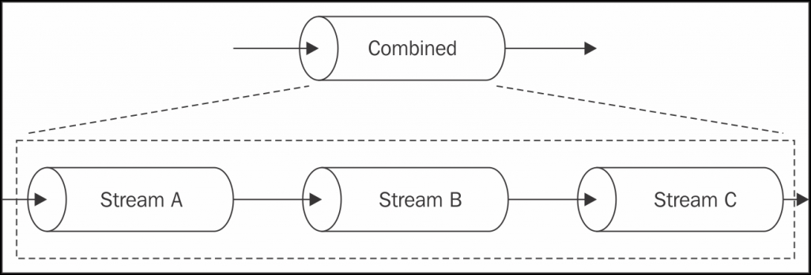
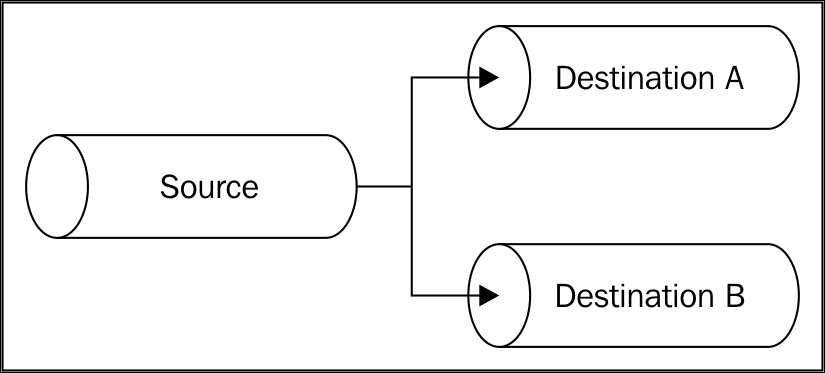
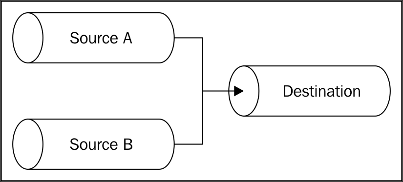
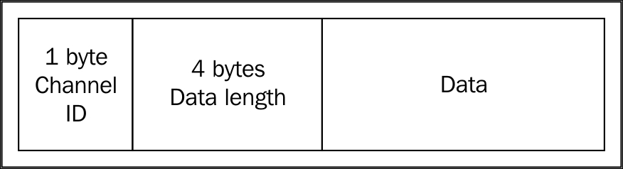
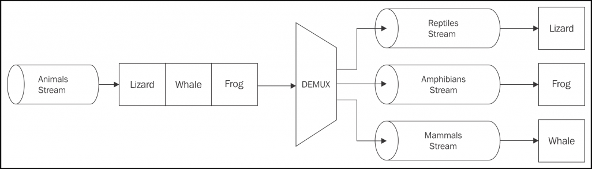

## 파이프 패턴

실제 배관과 마찬가지로, Node.js 스트림도 서로 다른 패턴으로 함께 연결(pipe)될 수 있다.
두 개의 서로 다른 스트림의 흐름을 하나로 병합하고, 한 스트림의 흐름을 두 개 이상의 연결(pipe)들로 분할하거나 조건에 따라 흐름을 리다이렉션 할 수 있다.
이 섹션에서는 Node.js에 적용 가능한 가장 중요한 배관 기술에 대해 살펴보자.

---

### 스트림 결합(combine)하기

스트림이 코드를 모듈화하고 재사용할 수 있는 간단한 인프라를 제공한다는 사실을 강조하고 있지만, 뭔가 중요한 부분이 빠진 것 같다.
전체 파이프라인을 모듈화하고 재사용하려면 어떻게 해야 할까?
여러 스트림들을 결합하여 외부에서 볼 때 하나인 것처럼 보이려면 어떻게 해야할까?
다음 그림은 이것이 의미하는 바를 보여준다.


[출처 : https://subscription.packtpub.com/book/web_development/9781785885587/5/ch05lvl1sec28/piping-patterns](https://subscription.packtpub.com/book/web_development/9781785885587/5/ch05lvl1sec28/piping-patterns)

위 그림을 보고 어떻게 할 수 있을지 어렴풋이 생각이 떠올라야 한다.

-   결합된 스트림에 쓸 때는 파이프라인의 첫 번째 스트림에 쓴다.
-   결합된 스트림으로부터 읽을 때는 파이프라인의 마지막 스트림에서 읽는다.

결합된 스트림은 보통 이중(Duplex) 스트림이며, 첫 번째 스트림을 Writable 쪽에 연결하고 마지막 스트림을 Readable쪽에 연결하여 만들어진다.

> 두 개의 서로 다른 스트림, 즉 Writable과 Readable에서 이중 스트림을 만들기 위해서는 duplexer2와 같은 npm 모듈을 사용할 수 있다.

하지만 이것만으로는 충분하지 않다. 결합된 스트림의 또 다른 중요한 특성은 파이프라인 내부의 모든 스트림에서 발생되는 모든 오류를 포착해야 한다는 것이다.
앞서 언급했듯이 오류 이벤트는 파이프라인을 따라 자동으로 전파되지 않는다.
따라서, 적절한 오류 관리를 해야 한다면 각 스트림에 오류 리스너를 명시적으로 부착해야 할 것이다.
그러나 결합된 스트림이 실제로 블랙박스라면 파이프라인 중간에 있는 스트림에 접근할 수 없으므로, 결합된 스트림에서는 스트림들에서 나오는 모든 에러를 수집하는 것이 매우 결정적이라 할 수 있을 것이다.

요약하면, 결합된 스트림은 다음과 같은 두 가지 중요한 이점을 가진다.

-   내부 파이프라인을 숨김으로써 블랙박스화 하여 재배포할 수 있다.
-   에러 리스너를 결합된 스트림 자체 외에 파이프라인의 각 스틀미들에 첨부하지 않도록 하여 에러관리를 간소화한다.

스트림을 결합하는 것은 매우 평범하고 일반적인 관행이다.
따라서 특별한 경우가 아니라면 multipipe와 combine-stream과 같은 기존 솔루션을 재사용해라.

---

#### 결합된 스트림 구현하기

간단하게 예를 들기 위해 다음 두개의 변환 스트림을 생각해보자.

-   데이터 압축 및 암호화
-   데이터의 암호를 해독하고 압축을 해제

multipipe 같은 라이브러리를 사용하면, 코어 라이브러리 중 우리가 이미 사용할 수 있는 몇몇 스트림들과 결합하여 이러한 스트림을 쉽게 만들 수 있다.

```javascript
const zlib = require("zlib");
const crypto = require("crypto");
const combine = require("multipipe");

module.exports.compressAndEncrypt = password => {
    return combine(zlib.createGzip(), crypto.createCipher("aes192", password));
};
module.exports.decryptAndDecompress = password => {
    return combine(
        crypto.createDecipher("aes192", password),
        zlib.createGunzip()
    );
};
```

이제 이렇게 결합된 스트림을 블랙박스처럼 사용할 수 있다.
예를 들어, 압축 및 암호화하여 파일을 보관하는 작은 어플리케이션을 만들 수 있다.
archive.js라는 새로운 모듈에서 그렇게 해보자.

```javascript
const fs = require("fs");
const compressAndEncryptStream = require("./combinedStream").compressAndEncrypt;

fs.createReadStream(process.argv[3])
    .pipe(compressAndEncryptStream(process.argv[2]))
    .pipe(fs.createWriteStream(process.argv[3] + ".gz.enc"));
```

만들어진 파이프라인 밖으로 결합된 스트림을 만들어 위의 코드를 더욱 향상시킬 수 있다.
이번에는 재사용 가능한 블랙박스를 얻는 것보다 수집된 에러 관리에 중점을 둔다.
사실, 이미 여러 번 언급했듯이 다음과 같이 작성하면 마지막 스트림에서 발생하는 오류만을 잡을 수 있다.

```javascript
fs.createReadStream(process.argv[3])
    .pipe(compressAndEncryptStream(process.argv[2]))
    .pipe(fs.createWriteStream(process.argv[3] + ".gz.enc"))
    .on("error", err => {
        // 마지막 스트림에서 발생하는 에러만 처리
        console.log(err);
    });
```

그러나 모든 스트림을 하나로 결합하여 이 문제를 세련되게 해결할 수 있다.
archive.js 파일을 다음과 같이 재작성 해보자.

```javascript
const combine = require("multipipe");
const fs = require("fs");
const compressAndEncryptStream = require("./combinedStreams")
    .compressAndEncrypt;

combine(fs.createReadStream(process.argv[3]))
    .pipe(compressAndEncryptStream(process.argv[2]))
    .pipe(fs.createWriteStream(process.argv[3] + ".gz.enc"))
    .on("error", err => {
        // 파이프라인 내의 모든 에러들을 처리
        console.log(err);
    });
```

여기서 알 수 있듯이 오류 리스너를 결합된 스트림에 직접 부착할 수 있으며, 모든 내부 스트림으로부터 발생된 에러를 수신할 수 있다.

archive 모듈을 실행하면 커맨드 라인 인수에 암호와 파일을 지정하기만 하면 된다.

```
node archive mypassword /path/to/a/file.txt
```

이 예제를 통해 우리는 스틀미을 결합하는 것이 얼마나 중요한지 확실히 알 수 있다.
한편으로는 스트림들을 재사용 가능한 조합으로 만들 수 있으며, 다른 한편으로는 파이프라인의 오류 관리를 단순화할 수 있다.

---

### 스트림 포크(fork)하기

하나의 Readable 스트림을 여러 Writable 스트림으로 연결함으로써 스트림을 포크할 수 있다.
이는 서로 다른 대상(예 : 서로 다른 두 개의 소켓 또는 서로 다른 두 개의 파일)에 동일한 데이터를 보내려는 경우에 유용하다.
또한 동일한 데이터에 대해 여러 가지 변형을 수행하거나 어떤 기준에 따라 데이터를 분할하려는 경우에도 사용할 수 있다.

다음 그림은 이 패턴을 보여준다.


[출처 : https://subscription.packtpub.com/book/web_development/9781785885587/5/ch05lvl1sec28/piping-patterns](https://subscription.packtpub.com/book/web_development/9781785885587/5/ch05lvl1sec28/piping-patterns)

Node.js에서 스트림을 포킹하는 것은 쉬운 일이 아니다.
예제를 통해 왜 그런지 이유를 살펴보자.

#### 다중 체크섬 생성기 구현

주어진 파일의 sha1과 md5 해시를 모두 출력하는 작은 유틸리티를 만들어 보겠다.
이 새로운 모듈을 generatehases.js라고 하고, 체크섬 스트림의 초기화부터 시작해보자.

```javascript
const fs = require("fs");
const crypto = require("crypto");

const sha1Stream = crypto.createHash("sha1");
sha1Stream.setEncoding("base64");

const md5Stream = crypto.createHash("md5");
md5Stream.setEncoding("base64");
```

지금까지 특별한 것은 없다.
모듈의 다음 부분은 실제 파일에서 Readable 스트림을 생성하고, 하나는 sha1 해시를 포함하고 다른 하나는 md5 체크섬을 포함하는 두 개의 파일을 얻기 위해 서로 다른 두개의 스트림으로 포크한다.

```javascript
const inputFile = process.argv[2];
const inputStream = fs.createReadStream(inputFile);
inputStream.pipe(sha1Stream).pipe(fs.createWriteStream(inputFile + ".sha1"));

inputStream.pipe)(md5Stream).pipe(fs.createWriteStream(inputFile + '.md5'));
```

매우 간단하다. inputStream 변수는 한쪽은 sha1Stream으로, 다른 한쪽은 md5Stream으로 파이프된다.
하지만 내부적으로 발생하는 몇 가지 주의해야 할 점이 있다.

-   pipe()를 호출할 때 {end: false}를 옵션으로 지정하지 않으면 InputStream이 끝날 때 md5Stream과 sha1Stream 모두 자동으로 종료된다.
-   포크된 두 스트림은 동일한 데이터 덩어리를 수신하기 때문에 데이터에 대한 연산으로 부작용이 발생 하지 않도록 매우 주의해야 한다. 한곳에서 수정한 데이터는 포크된 다른 모든 스트림에 영향을 줄 수 있다.
-   백프레셔가 바로 발생할 것이다. InputStream으로부터의 흐름은 분기된 스트림들 중 가장 느린 속도에 맞춰질 것이다.

---

### 스트림 병합(merge)하기

병합은 분기와 반대되는 잡업이며, 다음 그림과 같이 일련의 Readable 스트림을 하나의 Writable 스트림으로 파이프하는 것으로 구성된다.


[출처 : https://subscription.packtpub.com/book/web_development/9781785885587/5/ch05lvl1sec28/piping-patterns](https://subscription.packtpub.com/book/web_development/9781785885587/5/ch05lvl1sec28/piping-patterns)

여러 스트림을 하나로 병합하는 것은 일반적으로 간단한 작업이다.
그러나 auto end 옵션을 사용하는 연결(piping)은 소스 중 하나가 끝나는 즉시, 대상 스트림이 종료되도록 하므로 최종 이벤트를 처리하는 방식에 주의를 기울여야 한다.
동작 중인 소스에서 이미 종료된 스트림에 쓰기를 계속하므로 이로 인한 오류가 종종 발생할 수 있다.
이 문제에 대한 해결책은 여러 소스들을 하나의 대상에 연결할 때 {end: false} 옵션을 사용하고 모든 소스들이 읽기를 완료한 경우에만 대상에서 end()를 호출하는 것이다.

##### <u>여러 디렉터리에 대한 압축파일 만들기</u>

예제를 위해 두 개의 서로 다른 디렉터리의 내용으로 하나의 압축파일(tarball)을 만드는 작은 프로그램을 구현해 보자.
이를 위해 두 개의 새로운 NPM 패키지를 알아보자.

-   tar : 압축 파일을 만드는 스트리밍 라이브러리
-   fstream : 파일 시스템의 파일로부터 객체 스트림을 생성하는 라이브러리

이 새로운 모듈을 mergeTar.js라고 할 것이다.
몇 가지 초기화 단계부터 시작하여 내용을 정의해보자.

```javascript
const tar = require("tar");
const fstream = require("fstream");
const path = require("path");

const destination = path.resolve(process.argv[2]);
const sourceA = path.resolve(process.argv[3]);
const sourceB = path.resolve(process.argv[4]);
```

위의 코드에서 모든 종속성을 로드하고 대상 파일의 이름과 두 소스 디렉터리(sourceA, sourceB)를 포함하여 변수들을 초기화 시킨다.

다음으로 tar 스트림을 생성하고 목적 대상에 연결(pipe)gksek.

```javascript
const pack = tar.Pack();
pack.pipe(fstream.Writer(destination));
```

이제 소스 스트림들을 초기화할 차례다.

```javascript
let endCount = 0;
function onEnd() {
    if (++endCount === 2) {
        pack.end();
    }
}

const sourceStreamA = fstream
    .Reader({ type: "Directory", path: sourceA })
    .on("end", onEnd);
const sourceStreamB = fstream
    .Reader({ type: "Directory", path: sourceB })
    .on("end", onEnd);
```

위 코드에서 우리는 두 개의 소스 디렉터리(streamA와 streamB)로부터 읽어들이는 스트림을 생성하였다.
그런 후 두 소스 스트림에 두 개의 디렉터리들이 모두 읽혀져야만 pack 스트림을 종료할 end 리스너를 부착하였다.

마지막으로 실제 병합을 수행할 차례이다.

```javascript
sourceStreamA.pipe(pack, { end: false });
sourceStreamB.pipe(pack, { end: false });
```

두 소스를 pack 스트림으로 연결하고 두 개의 pipe() 호출에 {end: false} 옵션을 지정하여 대상 스트림의 자동 종료를 사용하지 않도록 하였음에 유의하라.

이것으로 간단한 TAR 유틸리티를 완성했다.
이 유틸리티는 대상 파일을 첫 번째 커맨드라인 인자로 제공하고 그 뒤에 두 개의 원본 디렉터리를 제공하여 실행할 수 있다.

```
node mergeTar dest.tar /path/to/sourceA /path/to/sourceB
```

이 섹션을 끝내기 위해 npm에서 스트림 병합을 단순화할 수 있는 몇 가지 모듈을 찾을 수 있는데, 예를 들면 다음과 같다.

-   merge-stream
-   multistream-merge

스트림 병합 패턴에 대한 마지막 주의점으로 대상 스트림으로 파이프된 데이터가 임의로 혼합된다는 점에 유의해야 한다.
이 속성은 일부 유형의 객체 스트림에서 수용할 수 있는 속성이지만(마지막 예제) 바이너리 스트림을 처리할 때 종종 원하지 않은 영향을 끼친다.

그러나 스트림을 순서대로 병합할 수 있는 한 가지 변형 패턴이 있다.
소스 스트림을 하나씩 처리하면서 동작하며, 이전 스트림이 종료되면 다음 스트림이 시작된다.
(모든 소스의 출력을 사슬처럼 잇는 것과 같다)
항상 그렇듯이 npm에서 이러한 상황을 다루는 패키지를 찾을 수 있다. 그 중 하나가 multistream이다.

---

### 멀티플렉싱과 디멀티플렉싱

병합 스트림 패턴에는 특별한 변형이 있다.
이 패턴에서 여러 스트림을 함께 결합하지 않고 대신 공유 채널을 사용하여 일련의 스트림 데이터를 전달한다.
이것은 소스 스트림이 공유 채널 내에서 논리적으로 분리되어 있기 때문에 개념적으로 다른 작업이다.
데이터가 공용 채널의 다른 끝에 도달하면 스트림을 다시 분할할 수 있다.
다음 그림은 이 상황을 명확하게 보여준다.


[출처 : https://subscription.packtpub.com/book/web_development/9781785885587/5/ch05lvl1sec28/piping-patterns](https://subscription.packtpub.com/book/web_development/9781785885587/5/ch05lvl1sec28/piping-patterns)

단일 스트림을 통한 전송을 가능하게 하기 위해 다중 스트림을 함께 결합하는 동작(이 경우 **채널** 이라고 함)이 **멀티플렉싱**(다중화)이고, 반대 동작, 즉 공유 스트림으로부터 수신된 데이터로 원본 스트림을 재구성하는 동작이 **디멀티플렉싱**(역다중화)이다.
이런 작업을 수행하는 장치를 각각 **멀티플렉서(또는 mux)** 그리고 **디멀티플렉서(또는 demux)** 라고 한다.
이는 컴퓨터과학 및 통신 분야에서 널리 연구되고 있는 분야로 전화, 라디오, TV 및 인터넷과 같은 거의 모든 유형의 통신 매체의 토대 중 하나이다.

여기서는 공유된 Node.js 스트림을 사용하여 논리적으로 분리된 여러 스트림을 전달하고 공유 스트림의 다른 끝에서 다시 분할하는 방법을 다룬다.

#### 원격 로거 만들기

이야기를 이끌어 내기 위해 예제를 보자.
우리는 자식 프로세스를 시작하고 표준 출력과 표준 오류를 모두 원격 서버로 리다이렉션하는 작은 프로그램을 만들 것이다.
그러면 원격 서버에서 두 스트림을 두 개의 개별 파일에 저장한다.
따라서 이 경우 공유된 매체는 TCP 연결이고 다중화될 두 개의 채널은 자식 프로세스의 stdout 및 stderr 이다.
IP, TCP 또는 UDP와 같은 프로토콜에서 사용되는 것과 동일한 기법인 **패킷 스위칭** 이라는 기술을 활용할 것인데, 이는 데이터 패킷으로 감싸 다양한 메타 정보를 지정할 수 있어 멀티플렉싱, 라우팅, 제어 흐름, 손상된 데이터 검사 등에 유용한 기술이다.
예제를 위해 구현하고자 하는 프로토콜은 매우 단순하다.
사실, 우리는 다음과 같은 구조의 패킷으로 우리의 데이터를 간단하게 감쌀 것이다.


[출처 : https://subscription.packtpub.com/book/web_development/9781785885587/5/ch05lvl1sec28/piping-patterns](https://subscription.packtpub.com/book/web_development/9781785885587/5/ch05lvl1sec28/piping-patterns)

앞의 그림에서 보듯이 패킷에는 실제 데이터뿐만 아니라 헤더(채널 ID + 데이터 길이)가 포함되어 있어 각 스트림의 데이터를 구분하고 디멀티플렉서에서 패킷을 올바른 채널로 라우팅할 수 있다.

##### <u>클라이언트 측 - 멀티플렉싱</u>

클라이언트 측에서부터 어플리케이션을 만들어보자.
창의적으로 client.js라고 부르자.
이것은 어플리케이션의 일부로 자식 프로세스를 시작시키고 스트림을 멀티플렉싱하는 역할을 담당한다.

모듈을 정의해보자. 먼저 몇가지 종속성이 필요하다.

```javascript
const child_process = require("child_process");
const net = require("net");
```

그런 다음, 소스 목록의 멀티플렉싱을 수행하는 함수를 구현해보자.

```javascript
function multiplexChannels(sources, destination) {
    let totalChannels = sources.length;
    for (let i = 0; i < sources.length; i++) {
        sources[i]
            .on("readable", function() {
                // [1]
                let chunk;
                while ((chunk = this.read()) !== null) {
                    const outBuff = new Buffer(1 + 4 + chunk.length); //[2]
                    outBuff.writeUInt8(i, 0);
                    outBuff.writeUInt32BE(chunk.length, 1);
                    chunk.copy(outBuff, 5);
                    console.log("Sending packet to channel: " + i);
                    destination.write(outBuff); //[3]
                }
            })
            .on("end", () => {
                if (--totalChannels === 0) {
                    destination.end();
                }
            });
    }
}
```

multiplexChannels() 함수는 다중화할 소스 스트림과 대상 채널을 입력으로 받은 다음, 아래의 과정을 수행한다.

1. 각 소스 스트림에 non-flowing 모드로 스트림에서 데이터를 읽을 수 있도록 readable 이벤트에 대한 리스너를 등록한다.
2. 데이터를 읽을 때 일련의 순서가 있는 패킷으로 감싼다. 패킷은 채널 ID 1바이트(UInt8). 패킷 사이즈 4바이트(UInt32BE) 그리고 실제 데이터 순이다.
3. 패킷이 준비되면 대상 스트림에 기록한다.
4. 마지막으로 모든 소스 스트림이 끝날 때 대상 스트림을 종료할 수 있도록 end 이벤트에 대한 리스너를 등록한다.

> 우리가 사용한 프로토콜은 채널을 식별하는데 1바이트 만을 사용하기 때문에 최대 256개의 소스 스트림을 멀티플렉싱할 수 있다.

클라이언트의 마지막 부분은 매우 간단하다.

```javascript
const socket = net.connect(3000, () => {
    const child = child_process.fork(process.argv[2], process.argv.slice(3), {
        slient: true
    });
    multiplexChannels([child.stdout, child.stderr], socket); //[3]
});
```

앞의 마지막 코드에서는 다음과 같은 동작을 수행한다.

1. 새로운 TCP 클라이언트 연결을 localhost:3000 에 대해 생성한다.
2. 첫 번째 커맨드 라인 인자를 경로로 사용하여 자식 프로세스를 시작하고 나머지 process.argv 배열을 자식 프로세스의 인수로 제공한다. 자식 프로세스가 부모의 stdout과 stderr을 상속받지 않도록 {silent: true} 옵션을 지정한다.
3. 끝으로 자식 프로세스의 stdout과 stderr를 취하여 multiplexChannels() 함수를 사용하여 소켓으로 멀티플렉싱한다.

##### <u>서버 측 - 역다중화</u>

이제 어플리케이션의 서버 측(server.js)을 만들어 보자.
여기서 우리는 원격 연결에서 스트림을 디멀티플렉싱하고 두 개의 서로 다른 파일로 연결한다.
demultiplexChannel()이라는 함수를 만드는 것에서 시작한다.

```javascript
const net = require("net");
const fs = require("fs");

function demultiplexChannel(source, destinations) {
    let currentChannel = null;
    let currentLength = null;

    source
        .on("readable", () => {
            // [1]
            let chunk;
            if (currentChannel === null) {
                // [2]
                chunk = source.read(1);
                currentChannel = chunk && chunk.readUInt8(0);
            }

            if (currentLength === null) {
                // [3]
                chunk = source.read(4);
                currentLength = chunk && chunk.readUInt32BE(0);
                if (currentLength === null) {
                    return;
                }
            }

            chunk = source.read(currentLength); // [4]
            if (chunk === null) {
                return;
            }
            console.log("Received packet from: " + currentChannel);
            destinations[currentChannel].write(chunk); // [5]
            currentChannel = null;
            currentLength = null;
        })
        .on("end", () => {
            // [6]
            destinations.forEach(destination => destination.end());
            console.log("Source channel closed");
        });
}
```

위 코드는 복잡해 보이지만 실제 그렇지 않다.
Node.js Readable 스트림의 특성상 아래 설명과 같이 우리는 우리가 만든 경량 프로토콜을 역다중화하도록 쉽게 구현할 수 있다.

1. non-flowing 모드를 사용하여 스트림을 읽는 것에서 시작한다.
2. 먼저 기존의 채널 ID가 없으면 스트림에서 1바이트를 읽고 숫자로 변환한다.
3. 다음 단계는 데이터의 길이를 읽는 것이다. 이를 위해 4바이트가 필요한데, 가능성이 희박하지만 내부 버퍼에 충분한 데이터가 다 도달하지 않았을 수 있다. 이 경우 this.read() 호출은 null을 반환할 것이다. 이 경우 구문 분석을 중단하고 다음 번 readable 이벤트에서 다시 시도하면 된다.
4. 마침내 데이터의 크기를 읽을 수 있게 되면, 내부 버퍼에서 가져올 데이터의 양을 알게 되므로 이를 모두 읽으려 시도한다.
5. 모든 데이터를 읽으면 올바른 대상 채널에 데이터를 쓸 수 있으며, currentChannel과 currentLength변수(다음 패킷을 분석하는데 사용됨)를 초기화해야 한다.
6. 끝으로 소스 채널이 끝나면 모든 대상 채널을 종료한다.

이제 소스 스트림을 역다중화 할 수 있게 되었으므로 새 기능을 시험하자.

```javascript
net.createServer(socket => {
    const stdoutStream = fs.createWriteStream("stdout.log");
    const stderrStream = fs.createWriteStream("stderr.log");
    demultiplexChannel(socket, [stdoutStream, stderrStream]);
}).listen(3000, () => console.log("Server started"));
```

앞의 코드에서 먼저 3000번 포트에서 TCP 서버를 시작한 다음, 수신한 각 연결에 대해 두 개의 다른 파일을 가리키는 2개의 Writable 스트림을 생성한다.
하나는 표준 출력용이고 다른 하나는 표준 오류용인데, 이들은 우리의 대상 채널이 된다.
마지막으로 우리는 demuliplexChannel()을 사용하여 소켓 스트림을 stdoutStream과 stderrStream으로 역다중화한다.

---

##### <u>mux/demux 어플리케이션 실행</u>

이제 새로운 mux/demux 어플리케이션을 사용할 준비가 되었다.
하지만 그에 앞서 먼저 작은 node.js 프로그램을 작성하여 샘플 출력을 만들어보자.
이 프로그램을 generateData.js라고 하자

```javascript
console.log("out1");
console.log("out2");
console.err("err1");
console.log("out3");
console.err("err2");
```

이제 원격 로깅 어플리케이션을 사용할 준비가 끝났다. 일단 서버를 실행하자.

##### <u>node server</u>

그런 다음, 클라이언트는 자식 프로세스로 시작하고자 하는 파일과 함께 아래와 같이 실행한다.

##### <u>node client generateData.js</u>

클라이언트는 거의 즉시 실행되고, 실행이 끝나면 generateData 어플리케이션의 표준 입력과 표준 출력은 하나의 단일 TCP 연결을 통해 이동하여 서버에서 두 개의 개별 파일로 역다중화 한다.

> child_process.fork() 를 사용하므로 우리의 클라이언트는 Node.js 모듈만을 시작시킬 수 있다.

##### 객체 스트림 다중화 및 역다중화

우리가 방금 본 예제는 바이너리/텍스트 스트림을 다중화 및 역다중화하는 방법을 보여주었다.
그러나 동일한 규칙이 객체 스트림에도 적용된다.
가장 큰 차이점은 객체를 사용하면 원자 메시지(atomic message, 객체)를 사용하여 데이터를 전송하는 방법을 이미 가지고 있으므로 다중화하는 것은 각 객체 내 channelID 속성을 설정하는 것으로 간단하며, 역다중화는 단순히 channelID 속성을 읽고 각 객체를 해당 대상 스트림으로 라우팅하면 된다.

역다중화를 위한 또 다른 패턴은 일부 조건에 따라 소스에서 오는 데이터를 라우팅하는 것으로 구성된다.
이 패턴을 사요하면 다음 그림과 같은 복잡한 흐름을 구현할 수 있다.


[출처 : https://subscription.packtpub.com/book/web_development/9781785885587/5/ch05lvl1sec28/piping-patterns](https://subscription.packtpub.com/book/web_development/9781785885587/5/ch05lvl1sec28/piping-patterns)

앞의 그림이 묘사하고 있는 시스템에서 사용되는 디멀티플렉서(역다중화)는 동물을 가리키는 객체의 스트림으로 가져와서 동물의 클래스에 따라 파충류, 양서류 그리고 포유류의 해당 대상 스트림으로 각각 라우팅한다.

동일한 원칙을 사용하여 스트림에 if...else 문을 구현할 수도 있다.
아이디어가 필요하다면, ternary-stream 패키지를 살펴보라.
