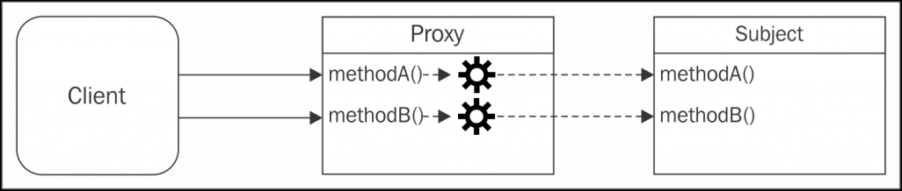

## 프록시(Proxy)

프록시는 다른 객체에 대한 접근을 제어하는 객체이다.
여기서 다른 객체를 **대상(Subject)** 이라고 한다.
프록시와 대상(Subject)은 동일한 인터페이스를 가지고 있으며 이를 통해 다른 인터페이스와 완전히 호환되도록 바꿀 수 있다.
실제 이 패턴의 다른 이름은 **서로게이트(surrogate)** 이다.
프록시는 대상(Subject)에서 실행될 작업의 전부 또는 일부를 가로채서 해당 동작을 향상시키거나 보완한다.
다음 그림은 대략적인 개념을 보여준다.



위 그림은 Proxy와 Subject가 동일한 인터페이스를 갖는 방식과 어떻게 이것이 클라이언트에게 투명하게 노출되어 둘 중 하나를 서로 교환하여 사용할 수 있는지 보여준다.
프록시는 각 작업을 대상(Subject)으로 전달하여 추가적인 전처리 또는 후처리로 동작을 향상시킨다.

> 클래스들 간의 프록시를 말하는 것이 아니라는 것을 이해하는 것이 중요하다.
> 프록시 패턴은 대상(Subject)의 실제 인스턴스를 감싸서 해당 상태를 유지하는 것을 포함한다.

프록시는 여러 상황에서 유용하다. 예를 들면, 다음과 같은 상황으 고려할 수 있다.

-   **데이터 유효성 검사(Data validation):** 프록시가 입력을 대상(Subject)으로 전달하기 전에 유효성을 검사한다.
-   **보안(Security):** 프록시는 클라리언트가 작업을 수행할 수 있는 권한이 있는지 확인하고 검사 결과가 긍정적인 경우에만 요청을 대상(Subject)으로 전달한다.
-   **캐싱(Caching)**: 프록시가 내부 캐시를 유지하여 데이터가 캐시에 아직 존재하지 않는 경우에만 대상(Subject)에서 작업이 실행되도록 한다.
-   **지연 초기화(Lazy initializtion):** 대상(Subject)의 생성 비용이 비싸다면 프록시는 그것을 필요로 할 때까지 연기할 수 있다.
-   **로깅(Logging):** 프록시는 메소드 호출과 상대 매개 변수를 인터셉트하고 이를 기록한다.
-   **원격 객체(Remote objects):** 프록시는 원격 위치에 있는 객체를 가져와서 로컬처럼 보이게 할 수 있다.

물론 프록시에 대한 더 많은 어플리케이션이 있으며, 이들은 그 목적과 범위에 대한 아이디어를 줄 것이다.

---

### 프록시 구현 기술

객체를 프록시할 때 우리는 모든 메소드를 가로채기로 결정할 수도 있고, 그 중 일부만 가로채고 나머지는 직접 대상(Subject)에 위임하기로 결정할 수도 있다.
이것을 달성할 수 있는 몇 가지 방법이 있는데, 그 중 일부를 분석해 본다.

#### 오브젝트 컴포지션

컴포지션은 기능을 확장하거나 사용하기 위해 객체가 다른 객체와 결합되는 기술이다.
특정 프록시 패턴의 경우, 대상(Subject)과 동일한 인터페이스를 가진 새로운 객체가 작성되고 대상(Subject)에 대한 참조가 인스턴스 변수 혹은 클로저 변수 형식으로 프록시의 내부에 저장된다.
대상(Subject)은 작성 시 클라이언트로부터 주입되거나 프록시 자체에 의해 작성될 수 있다.
다음은 의사(pseudo) 클래스와 팩토리를 사용한 이 기법의 한 예이다.

```javascript
function createProxy(subject) {
    const proto = Object.getPrototypeOf(subject);

    function Proxy(subject) {
        this.subject = subject;
    }

    Proxy.prototype = Object.create(proto);

    //프록시된 메소드
    Proxy.prototype.hello = function() {
        return this.subject.hello() + " world!";
    };
    //델리게이트된 메소드
    Proxy.prototype.goodbye = function() {
        return this.subject.goodbye.apply(this.subject, arguments);
    };

    return new Proxy(subject);
}
module.exports = createProxy;
```

컴포지션을 사용해 프록시를 구현하려면, hello()와 같이 조작하고자 하는 메소드를 가로채고 나머지는 단순히 대상(Subject)에 위임해야 한다.(goodbye()와 마찬가지로).

위의 코드는 대상(Subject)이 프로토타입을 가지고 있고 제대로 된 프로토타입 체인을 유지 하기 위한 특정한 사례를 보여주므로 proxy instanceof Subject를 실행하면 true가 반환된다.
우리는 이것을 달성하기 위해 의사고전(pseudo-classical) 상속을 사용했다.

이는 프로토타입 체인을 유지 관리하는 것이 중요한 경우에만 필요한 부수적인 단계이다.
프록시 체인은 처음에 대상(Subject)과 관련된 코드와의 호환성을 개선하는데 유용할 수 있다.

하지만, JavaScript에는 동적 타입 결정이 있으므로 대부분의 경우 상속을 사용하지 않고 보다 즉각적인 접근 방식을 사용할 수 있다. 예를 들어, 앞의 코드에서 제시한 프록시의 대체 구현은 그냥 객체 리터럴과 팩토리를 사용하는 것일 것이다.

```javascript
function createProxy(subject) {
    return {
        //프록시된 메소드
        hello: () => subject.hello() + " world!",

        //델리게이트된 메소드
        goodbye: () => subject.goodbye.apply(subject, arguments)
    };
}
```

> 대부분의 메소드를 위임하는 프록시를 만들려면 delegates와 같은 라이브러리를 사용하여 자동으로 생성하는 것이 편리할 것이다.

### 객체 증강(Object argumentation)

객체 증강(또는 몽키 패치)은 아마도 객체의 개별 메소드를 프록시하는 가장 실용적인 방법일 수 있는데, 메소드를 프록시된 구현체로 대체하여 직접 대상(Subject)을 수정하는 것으로 이루어진다.

```javascript
function createProxy(subject) {
    const helloOrig = subject.hello;
    subject.hello = () => helloOrig.call(this) + "world!";

    return subject;
}
```

이 기법은 하나 또는 몇 개의 메소드만 프록시할 필요가 있을 때 가장 편리한 메소드지만, 대상(Subject) 객체를 직접 수정하는 단점이 있다.

---

### 다른 기술의 비교

컴포지션은 프록시를 만드는 가장 안전한 방법으로 간주될 수 있다.
대상(Subject)을 그대로 두어 원래의 동작을 변경하지 않기 때문이다.
유일한 단점은 모든 메소드를 수동으로 위임(delegate)해야 한다는 것이다.
필요한 경우 대상(Subject)의 속성에 대한 액세스 권한을 위임해야 할 수도 있다.

> 객체의 속성은 Object.defineProperty()를 사용하여 위임할 수 있다.

반면 객체 증강은 대상(Subject)을 수정하므로 위임과 관련된 여러 가지 불편함이 없다.
이러한 이유로 객체 증강은 JavaScript에서 프록시를 구현하는 가장 실용적인 방법이며, 대상(Subject)을 수정하는 것이 큰 문제가 되지 않는 모든 상황에서 선호되는 기술이다.

그러나 컴포지션이 필요한 한 가지 상황이 있다.
예를 들어 대상(Subject)을 필요한 경우에만 큰 문제가 되지 않는 모든 상황에서 선호되는 기술이다.

그러나 컴포지션이 필요한 한 가지 상황이 있다. 예를 들어 대상(Subject)을 필요한 경우에만 생성(예: 지연 초기화 - lazy initialization)하기 위해 대상(Subject)의 초기화를 제어하려는 경우이다.

> 팩토리 함수(createProxy())를 사용하여 프록시를 생성하면, 사용된 기술로부터 코드를 보호할 수 있다는 점을 기억해 두라.

---

### Writable 스트림 로그 작성

실제 예제에서 프록시 패턴을 보기 위하여 write() 메소드에 대한 모든 호출을 가로채고 이러한 상황이 발생할 때마다 메시지를 기록하는 Writable 스트림에 대한 프록시를 수행하는 개체를 만들어 보자.
프록시를 구현하기 위해 객체 컴포지션을 사용한다.
다음은 이를 위한 loggingWritable.js이다.

```javascript
function createLoggingWritable(writableOrig) {
    const proto = Object.getPrototypeOf(writableOrig);

    function LoggingWritable(writableOrig) {
        this.writableOrig = writableOrig;
    }

    LoggingWritable.prototype = Object.create(proto);

    LoggingWritable.prototype.write = function(chunk, encoding, callback) {
        if (!callback && typeof encoding === "function") {
            callback = encoding;
            encoding = undefined;
        }
        console.log("Writing ", chunk);
        return this.writableOrig.write(chunk, encoding, function() {
            console.log("Finished writing ", chunk);
            callback && callback();
        });
    };

    LoggingWritable.prototype.on = function() {
        return this.writableOrig.on.apply(this.writableOrig, arguments);
    };

    LoggingWritable.prototype.end = function() {
        return this.writableOrig.end.apply(this.writableOrig, arguments);
    };

    return new LoggingWritable(writableOrig);
}
```

앞의 코드에서 인자로 전달된 Writable 객체가 프록시된 버전을 반환하는 팩토리를 만들었다.
호출할 때마다 그리고 비동기 연산이 완료될 때마다 표준 출력에 메시지를 기록하도록 write() 메소드를 오버라이드 한다.
또한 이것은 비동기 함수의 프록시를 만드는 훌륭한 예이기도 한다.
이것은 Node.js와 같은 플랫폼에서 고려해야 할 중요한 세부 사항이다.
나머지 메소드인 on() 및 end()는 원래의 writable 스트림에 위임된다.(코드를 가볍게 유지하기 위해 쓰기 가능한 인터페이스의 다른 메소드는 고려하지 않는다).

방금 생성한 프록시를 테스트하기 위해 loggingWritable.js에 몇 줄의 코드를 더 추가해보자.

```javascript
const fs = require("fs");

const writable = fs.createWriteStream("test.txt");
const writableProxy = createLoggingWritable(writable);
writableProxy.write("First chunk");
writableProxy.write("Second chunk");
writable.write("This is not logged");
writableProxy.end();
```

프록시는 스트림의 원래 인터페이스나 외부 동작을 변경하지 않았지만, 위 코드를 실행하면 스트림에 기록된 모든 데이터가 그대로 콘솔에 기록된다.

---

### 생태계에서의 프록시 - 함수 후크(function hooks) 및 AOP

다양한 형태의 프록시는 Node.js 자체에서 뿐만 아니라 생태계에서도 널리 사용되는 패턴이다.
사실, 우리는 프록시 생성을 단순화 할 수 있는 라이브러리들을 많이 볼 수 있다.
대부분의 경우 구현 방식으로 객체 증강(object augmentation)을 사용한다.

커뮤니티에서 이 패턴은 **함수 후킹(function hooking)** 이라고도 하며, 떄로는 프록시 어플리케이션의 공통 영역인 **AOP(Aspect Oriented Programming)** 라고도 합니다.
AOP에서 이러한 라이브러리는 대개 개발자가 특정 메소드(혹은 메소드들) 전후에 실행 후크를 설정할 수 있도록 한다.
이것은 권고된 메소드를 실행하기 전 혹은 후에 커스텀 코드를 실행할 수 있게 해준다.
